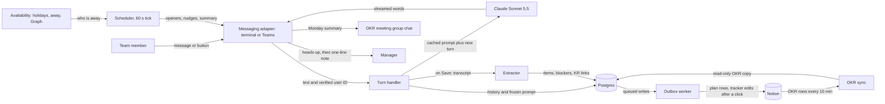
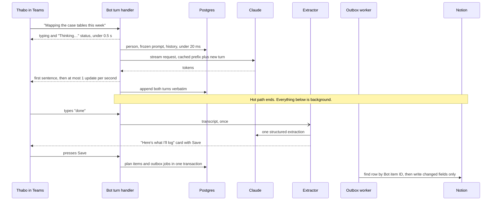

# Weekly Coach bot: design

Status: agreed design after an independent expert review (October 2026). Everything below uses the fictional sample team in `config/team.sample.yaml`: Jordan (team lead), Amara, Thabo, Wanjiru, Pieter and Lindiwe. Real names, IDs and tracker content live only in git-ignored `*.local.yaml` and `*.local.json` files.

## 1. Summary

The Weekly Coach is one TypeScript service (Node 22) that helps each team member plan their week against the team's OKRs (objectives and key results).

- **Monday.** At 08:30 in each person's own time zone, the bot sends a direct message (DM) in Microsoft Teams. It lists last week's unfinished items and asks "Do you plan to finish this off?" It then coaches one question at a time: what done looks like by Friday, the two to four steps, blockers (access, people, decisions, data, time) and which key result (KR) the work supports. It never does the work itself.
- **Mid-week and Friday.** A short check-in on Wednesday and a review on the last working day.
- **The team.** One summary post on Monday afternoon in the team's existing OKR meeting group chat.
- **If someone goes quiet.** Two gentle nudges, then a heads-up that shows the exact line the manager would receive, then (only if there is still no reply) that one line to the manager, copied to the person. "I'm stuck" reaches the manager only with the person's consent and in their own words.
- **Records.** The plan is logged to a new Notion database, "Weekly Plans & Check-ins". The curated OKR tracker is never changed without a person pressing a confirm button.
- **Speed.** A chat turn reads only the local database and streams Claude's reply. Notion, calendar checks and plan extraction never sit between a message and its reply. The target is first words on screen in about 2 seconds.
- **Swappable parts.** Teams, Notion, Microsoft Graph (calendars and presence) and Claude each sit behind an interface ("port"). Phases 1 to 4 therefore run on a laptop with no IT approval.

## 2. Diagrams

The whole system (13 boxes):



One chat turn. Everything above the note is the "hot path" the person waits on; everything below it runs in the background.



## 3. Components and repo layout

| Component | Job |
|---|---|
| Turn handler | Checks who the sender is, loads the conversation, streams Claude's reply, appends both turns. |
| Prompt assembly | Builds the cached request: coach prompt, OKR snapshot, person context, history. |
| Router | Decides which conversation an incoming message or button press belongs to. |
| Week cycle | Plain code that moves each person through the week. The model never decides state. |
| Extractor | One structured call when the person says they are done, producing the Save card. |
| Scheduler | A 60-second tick that sends openers, check-ins, nudges, heads-ups and the summary. |
| Outbox worker | Writes to Notion in the background, at most 2 requests per second. |
| OKR sync | Copies the tracker into Postgres every 10 minutes (read-only copy). |
| Ops report | The daily health DM to the team lead. |

```
config/    team.sample.yaml  bot.yaml  notion.sample.yaml   (real copies: *.local.yaml, git-ignored)
prompts/   coach.md  extraction.md
fixtures/  q4-tracker.sample.json      (fictional; real exports are *.local.json, git-ignored)
eval/      personas.json  refusal-prompts.json  judge.md  simulated-user.md
docs/      design.md  ask-IT.md
scripts/   chat.ts eval.ts report.ts simulate-week.ts notion-check.ts
           notion-create-weekly-db.ts link-users.ts
src/
  main.ts  config.ts  clock.ts
  domain/     schemas.ts okr.ts
  ports/      llm.ts messaging.ts store.ts planningStore.ts directory.ts availability.ts
  core/       turnHandler.ts promptAssembly.ts routing.ts weekCycle.ts carryOver.ts
              extraction.ts cards.ts cardCapture.ts suggestions.ts
  policy/     ladder.ts managerNotes.ts teamSummary.ts privacy.ts
  scheduler/  tick.ts prepareWeek.ts workCalendar.ts
  store/      migrations/*.sql  pgStore.ts
  workers/    okrSync.ts outboxWorker.ts purge.ts opsReport.ts
  adapters/   console/ teams/ anthropic/ scripted/ notion/ graph/ config/ jsonFile/
test/
```

## 4. Ports and adapters

A port is a TypeScript interface; an adapter is one implementation of it. Sketches:

```ts
export interface LLMPort {
  streamTurn(req: TurnRequest, onText: (delta: string) => void, signal?: AbortSignal): Promise<TurnResult>;
  extract<T>(schema: z.ZodType<T>, transcript: string): Promise<T | null>;   // Phase 2, once per Save
}
// TurnResult: text, content (verbatim), stopReason, refusalCategory, firstTextMs, usage

export interface ReplyStream {
  status(text: string): Promise<void>;   // typing + "Thinking…", before any text
  push(delta: string): void;             // adapter buffers: first sentence, then ≤1 update/s
  end(): Promise<SentRef>;
  replace(text: string): Promise<void>;  // swap streamed text for the refusal redirect
}

export interface MessagingPort {
  start(h: {
    onMessage(e: { aadObjectId: string; tenantId: string; text: string }, r: ReplyStream): Promise<void>;
    onCardAction(e: CardAction): Promise<CardSpec | void>;   // code only, under 500 ms
    onInstall(e: { aadObjectId?: string; chatKey?: string; conversationRef: string }): Promise<void>;
  }): Promise<void>;
  sendDirect(personId: string, m: TextOrCard): Promise<SentRef>;
  postToChat(chatKey: string, markdown: string): Promise<SentRef>;
  edit(ref: SentRef, m: TextOrCard): Promise<void>;          // card updates, summary edits
  readonly caps: { streaming: boolean };
}

export interface Store {                 // async from day one; PGlite locally, pg in production
  tx<T>(fn: (s: Store) => Promise<T>): Promise<T>;
  people: PeopleRepo; weeks: WeekRepo; items: PlanItemRepo; conversations: ConversationRepo;
  touchpoints: TouchpointRepo; notes: ManagerNoteRepo; outbox: OutboxRepo; audit: AuditRepo;
}

export interface PlanningStorePort {     // Notion; never on the hot path
  listOkrRows(editedSince?: Date): Promise<OkrRow[]>;
  findPlanItemByKey(botItemId: string): Promise<string | null>;
  upsertPlanItem(i: PlanItemRecord, changed: string[]): Promise<{ pageId: string }>;
  readTrackerField(pageId: string, field: SuggestableField): Promise<unknown>;
  applyTrackerChange(s: ConfirmedSuggestion): Promise<"applied" | "stale">;
}

export interface DirectoryPort {
  team(): Person[];
  byAadObjectId(id: string): Person | undefined;   // undefined = not on the team
  managerOf(personId: string): Person | undefined;
}

export interface AvailabilityPort {
  week(p: Person, weekStart: string): Promise<DayStatus[]>;   // working | away | holiday | non_working
  awayNow(p: Person): Promise<"working" | "away" | "unknown">;
}
```

| Port | Phase 1 | Phase 2 | Phase 3 | Phase 4 | Phase 5 |
|---|---|---|---|---|---|
| LLM | `ClaudeLLM` | + `extract` | same | `ScriptedLLM` for `simulate-week` | same |
| Messaging | console | console | console | `TeamsMessaging` in the Agents Playground | Teams, hosted |
| Store | in memory | `PgStore` on PGlite | same | same | `PgStore` on Azure Postgres |
| PlanningStore | `JsonFilePlanningStore` (fixture) | same | `NotionPlanningStore` | same | same |
| Directory | `ConfigDirectory` (`team.yaml`) | same | same | same | + IDs from `link-users` |
| Availability | none | none | none | `ConfigAvailability`: `date-holidays` (ZA, KE) + `/away` | + `GraphAvailability` |

## 5. Data model

**Master copies.** OKRs: the Notion tracker (Postgres keeps a read-only copy). Plans, conversations and bot state: Postgres. Notion "Weekly Plans & Check-ins" is the copy people read. Transcripts never leave Postgres except to the Claude API.

**Postgres tables** (Postgres-dialect SQL throughout, e.g. `INSERT … ON CONFLICT DO NOTHING`):

| Table | Key columns | Phase |
|---|---|---|
| `people` | id, aad_object_id, email, notion_user_id, tz, country, working_days, manager_id, active | 2 |
| `okr_rows` | page_id, type, objective, kr_code, name, status, blocked, current_state, due, owner_ids, parent_kr_id, source | 2 |
| `weeks` | person_id, week_start, state, plan_saved_at, skipped_reason | 2 |
| `plan_items` | id (Bot item ID), person_id, week_start, title, kr_code, kr_page_id, carried_from_id, carry_count, done_looks_like, actions, blockers, status, share, ask_team, confirmed, notion_page_id, notion_written | 2 |
| `checkins` | plan_item_id, kind, status, note, at | 2 |
| `conversations` | id, person_id, week_start, kind, frozen_system, model_cfg, refusals | 2 |
| `messages` | conversation_id, seq, role, content_json. **Append-only**: a database trigger rejects UPDATE and DELETE; only the purge job removes whole conversations. | 2 |
| `turn_metrics` | first_text_ms, total_ms, cache_read_tokens, input/output tokens | 2 |
| `outbox` | idem_key UNIQUE, op, payload, state, attempts, next_attempt_at, last_error | 3 |
| `tracker_suggestions` | page_id, field, old_value, new_value, state, confirmed_by, card_ref | 3 |
| `touchpoints` | person_id, week_start, kind, seq, due_utc, valid_until_utc, state, sent_ref. UNIQUE(person_id, week_start, kind, seq) | 4 |
| `manager_notes` | person_id, week_start, kind (no_plan / stuck / swamped), text, consent_at, hold_until, state | 4 |
| `away` | person_id, from, to, source (command / graph) | 4 |
| `conversation_refs` | key, scope (personal / groupChat), ref_json | 4 |
| `team_posts` | week_start, chat_key, activity_id, body_hash, edit_until | 4 |
| `audit_events` | at, actor, action, subject, detail_json (no message content) | 4 |

**Notion "Weekly Plans & Check-ins"** (one row per item per week, one database per quarter):

| Property | Type | Purpose |
|---|---|---|
| Item | title | "Thabo · 2026-W43 · Map case tables" |
| Person | people | Owner |
| Week of | date | First day of the week |
| Status | status | Planned / In progress / Blocked / Done / Partly / Carried over / Dropped |
| KR | relation, `single_property` | Link to the KR row. Single-property means no back-column is added to the curated tracker. |
| KR code | rich_text | "2.1"; stays readable after the quarter changes |
| Done looks like | rich_text | Outcome by Friday |
| Actions | rich_text | Two to four steps |
| Blockers | rich_text | Plain words, truncated at Notion's 2,000-character limit |
| Blocker type | multi_select | Access / Data / People / Decision / Setup / Time |
| Mid-week update, Friday outcome | rich_text | Dated lines |
| Carried over from | relation to itself | Added in a second step, once the database exists |
| Confirmed by person | checkbox | Unticked means saved as a draft |
| Bot item ID | rich_text | Looked up before creating, so retries never duplicate a row |

The page is restricted to the team. Its description says rows are written by the bot. The outbox sends only fields whose value changed since its last write, so a hand edit to another field is never overwritten.

**Config.** Zod checks every file at start-up. Sample files are committed; real ones are `*.local.yaml`.

```yaml
# config/bot.yaml
tenantId: ${TENANT_ID}
replyMode: stream                 # stream | single
workingHours: { start: "08:00", end: "17:00" }
extraHolidays: { KE: [], ZA: [] }  # short-notice public holidays
ladder:                           # day = nth working day of the person's week, local time
  opener:      { day: 1, time: "08:30" }
  nudge1:      { day: 1, time: "13:30" }
  nudge2:      { day: 2, time: "09:30" }
  headsUp:     { day: 3, time: "09:30" }
  managerNote: { day: 4, time: "10:00" }
checkins: [{ day: WED, time: "10:00", nudgeAfter: "3h" }]
review:   { day: LAST_WORKING_DAY, time: "14:00", nudgeAfter: "3h" }
summary:  { chat: okr-meeting, day: MON, time: "14:00", tz: Africa/Johannesburg, editUntil: "WED 12:00" }

# config/notion.local.yaml (real IDs; git-ignored)
notionVersion: "2026-03-11"
trackerWriteMode: off             # off | dry-run | live
okrTracker: { dataSourceId: "<from npm run notion:check>", fields: { … }, suggestable: [Status, Blocked, Current state] }
weeklyPlans: { dataSourceId: "<printed by notion:create-db>" }

# config/team.local.yaml adds, per person: country, workingDays, email (aadObjectId and notionUserId come from link-users)
```

The tracker's schema (one table of KR and Task rows with Type, Objective, KR code, Parent KR, Status, Blocked, Blocked by, Current state, Description, Due, Primary and Secondary owner, and Source) is mapped to the bot's own field names in `fields`. Rows whose Source is Proposed or Rejected are dropped from the OKR snapshot, carry-over candidates and KR suggestions.

## 6. The week, routing and coaching

**State per person per week.** Code moves people through these states:

```
SCHEDULED → OPENER_SENT → PLANNING → PLAN_SAVED (or DRAFT_SAVED)
  → CHECKIN_SENT → CHECKIN_DONE → REVIEW_SENT → CLOSED
OPENER_SENT → NUDGED_1 → NUDGED_2 → HEADS_UP → NOTE_SENT
any → AWAY (whole week) | SKIPPED ("Skip this week")
```

**Conversations.** Monday planning, the check-in and the review are separate Claude conversations, each started fresh from Postgres with its own frozen OKR snapshot.

**Routing rules** (Phase 2):
1. A typed message joins the person's open conversation for this week if it is still inside its validity window (planning until Wednesday 12:00; check-in and review until the end of that day).
2. Otherwise, before Wednesday 12:00 with no plan, it starts late planning. After that it starts a short "update" conversation that records news or a new blocker against this week's items.
3. Every card carries its week and touchpoint. A button pressed after its week or touchpoint has closed changes nothing; the card is replaced with "This one has expired. Here's where we are now."
4. No check-in goes to someone without a saved plan or draft. On a day with a heads-up, the check-in is skipped.
5. A review for someone with no plan is one light question: "How did the week go? Anything to carry into next week?"
6. Commands: `/plan`, `/away 2026-10-21..23`, `/skip`, `/mine`, `/help`.
7. One turn per person runs at a time. Messages that arrive meanwhile are joined into the next turn.

**Carry-overs.** Candidates are last week's items not marked Done or Dropped, plus "In progress" tracker Tasks the person owns: at most three, by due date. Buttons: [Finish it] [Carry part of it] [Already done] [Drop it]. "Carry part of it" closes the old item as Partly and creates a new linked item whose title the person edits. "Already done" offers a tracker suggestion card. On a third carry-over, the coach offers to re-scope it. On the first Monday of a new quarter, carried items get a KR picker so they can be re-linked.

**Coaching.** `prompts/coach.md` states the team's legitimate anti-fraud remit and these rules: one question per message, at most 80 words; reflect back, offer options rather than instructions; never do the task; respect "skip". Per item it covers done-by-Friday, steps, a blocker sweep, the KR link ("Sounds like KR 2.1?"; "none" is fine) and the first step today. When everything is covered, the coach recaps and asks the person to type "done". One extraction then builds the "Here's what I'll log" card: items, KR (changeable), blockers, a "share in the team summary" tick and [Save] [Change something]. If there is no click within two working hours, the plan is saved as a draft (Confirmed = false). Button choices are added to the conversation as a short line from the person, e.g. `[Chose: Finish "Map case tables"]`.

**Example messages** (collaborative, never managerial):

- Opener (Thabo, Monday 08:30): "Morning Thabo. New week, so let's sketch it out together. Two things were still open from last week: *Map case tables to target entities* and *Data-quality tests for null case IDs*. Do you plan to finish these off?" [Finish it] [Carry part of it] [Already done] [Drop it]
- Coaching: "Nice, so the mapping is the big one. If it goes well, what could you show Wanjiru on Friday?"
- Blocker sweep: "Is there anyone you need to hear from, or any access still pending, before you can start?"
- KR link: "This sounds like KR 2.1, the case data model. Does that fit?"
- Check-in (Amara, Wednesday 10:00 Nairobi time): "Hi Amara, quick check-in. How's *Audit log access request* going?" [On track] [Slower than hoped] [Stuck] [Done]
- Review (Wanjiru, Friday): "Happy Friday, Wanjiru. How did *Labelling guide* land?" [Done] [Partly] [Didn't start] [Dropped] Then: "What helped, and what got in the way?"
- Nudge (Lindiwe, Monday 13:30): "No rush, Lindiwe. If now isn't great, three quick bullets is plenty." [Plan now] [Light week] [Skip this week]

## 7. Scheduler, time zones, holidays and sending once

- **Clock and zones.** `tick.ts` runs every 60 seconds against a `Clock` that tests can fake. Times use each person's IANA time-zone name (`Africa/Johannesburg`, SAST, UTC+2; `Africa/Nairobi`, EAT, UTC+3). No code assumes either zone is free of daylight saving.
- **`prepareWeek`** runs at 04:30 UTC on the first day of the week, and again on start-up if it has not run for the current week. It syncs OKRs, works out each person's working days and inserts the week's touchpoints with `ON CONFLICT DO NOTHING`, so running it twice is harmless.
- **Holidays.** `date-holidays` for South Africa (ZA) and Kenya (KE), plus `extraHolidays` in `bot.yaml` for holidays Kenya declares at short notice. Ladder days count the person's working days, so for the week of 19 October Amara's and Wanjiru's day 2 is Wednesday (Tuesday is Mashujaa Day in Kenya).
- **Out of office.** Phase 4 uses `/away`. Phase 5 adds Microsoft Graph: `getSchedule` once for the week (calendar items marked out of office) and `outOfOfficeSettings.isOutOfOffice` checked just before each send. If Graph fails, the person counts as "unknown", which means no nudge and no manager note.
- **Rules.** A holiday or leave on day 1 moves the opener to the next working day. Ladder steps that would land after the person's last working day are dropped. The review moves to the last working day. Nothing is sent outside working hours.
- **Exactly once.** A touchpoint is claimed with `UPDATE … SET state='sending' WHERE id=$1 AND state='due'`, sent, then marked `sent` with its message reference. On restart, any row still `sending` becomes `sent_unknown` and is **never resent**: a lost message is caught by the next nudge, while a duplicate costs trust. A touchpoint past `valid_until` becomes `expired`. Someone with no stored Teams conversation is marked `unreachable` and listed in the ops DM.
- **One scheduler.** Container Apps runs exactly one replica, but a deployment can briefly run two. The tick only runs while holding a Postgres advisory lock.
- **Outbox.** Each job has a unique key. Before creating a Notion row the worker calls `findPlanItemByKey` (Notion has no request idempotency keys). It sends at most 2 requests per second and honours `Retry-After`, leaving room in the workspace-wide limit shared with other automations.

## 8. Nudges, escalation and the team summary

All times assume a Monday start and are in the person's local time. Any reply or button press stops the ladder.

| Step | When | To | What |
|---|---|---|---|
| Opener | Day 1, 08:30 | Person | Carry-overs and the first question |
| Nudge 1 | Day 1, about 13:30 (four working hours later) | Person | "Three quick bullets is plenty." |
| Nudge 2 | Day 2, 09:30 | Person | Shorter still, with [Skip this week] |
| Heads-up | Day 3, 09:30 | Person | Shows the exact manager line, with [Doing it now] [Tell my manager I'm swamped] [Skip this week] |
| Manager note | Day 4, 10:00 | Manager, copied to the person | The one line, nothing else. At most one per person per week. |

Heads-up to Lindiwe: "Hi Lindiwe, I haven't caught you this week, and that's fine; weeks get busy. If I don't hear from you by Thursday 10:00, I'll send Jordan just this line: *'Lindiwe hasn't had a chance to plan this week yet.'* Nothing else is shared."

- **Check-ins and the review** get one nudge three working hours later, then expire. They never escalate.
- **[Skip this week]** stops everything for that week and never escalates. "Tell my manager I'm swamped" sends "Lindiwe is swamped this week and will plan when she can", copied to her.
- **Stuck is consent-only.** It is offered when the person taps [Stuck], when the same blocker appears at two touchpoints in a row, or on a third carry-over. Pieter: "This is the second check-in where the telemetry extract is holding you up. Would a note to Jordan help? You write it, I send it as it is, and you get a copy." [Write a note] [Not now]. The note is the person's own words, at most two lines, editable before sending.
- **Manager away** (leave, out of office, or Graph status unknown all count as away). A no-plan note is held until the manager's first working day back, and dropped if the week has closed by then. A stuck note is held; the person is told the return date and offered [Ask the team]. There is no deputy.
- Jordan's own items never escalate. The manager never sees transcripts. Every send is written to `audit_events`.

**Team summary.** Built in code from Postgres, never written by the model. One post at Monday 14:00 SAST in the existing OKR meeting group chat (the bot is added with the `groupChat` scope). Teams does not stream in group chats, so it is a single message, edited in place as late plans arrive until Wednesday 12:00.

> **Week of 19 Oct: what we're on**
> *Last week:* 9 done · 3 partly · 2 carried over
> Amara: Audit log access request (KR 1.1) · 500-case sample design (KR 1.2)
> Thabo: Map case tables (KR 2.1)
> Pieter: Away
> *Could use help:* Thabo is looking for someone who knows the case system's audit tables.
> *KRs with nothing planned:* 1.3, 3.3, 4.3

Shown: titles the person left ticked, KR codes, "Away", help requests only when the person tapped [Ask the team], and KRs with nothing planned. Never shown: who hasn't planned, nudges, blocker detail, or why anyone is away.

## 9. Latency

| Step | Budget | Notes |
|---|---|---|
| Teams → Bot Connector → app in South Africa North | 150–400 ms | The Bot Connector is a global service; not visible to the app |
| Verify token, tenant and team list | under 10 ms | Signing keys cached |
| Typing and "Thinking…" status | sent within 50 ms, seen within 0.5 s | First thing the handler does |
| Load conversation from Postgres | under 20 ms | Same region; no Notion or Graph call |
| South Africa → Anthropic API (US) round trip | 250–350 ms | Kept-alive connection |
| Model to first text, warm cache, effort `low` | 0.5–1.2 s | Measured in Phase 1 |
| Teams' limit of one streaming update per second | 0–0.5 s | The status counts as one update, so the first text chunk follows it by at least 1 s |
| App → Teams | 150–300 ms | |
| **Server-measured first text** | **p50 ≤2.0 s, p95 ≤3.5 s** | Median and 95th percentile, from `turn_metrics` |
| What the person sees | about 0.3–0.7 s more | The two Teams legs |
| Button press → updated card | under 300 ms | Code only; Notion writes are queued |

Safeguards: if no text has arrived after 10 seconds, the bot shows "Still thinking…", aborts, retries once outside the turn and delivers the reply as a new message. Streams end at 12 seconds and any remainder is sent as a normal message, to stay inside the Bot Service's turn timeout (to be tested in Phase 4). `replyMode: single` switches streaming off if Teams misbehaves.

**Chat request settings** (exact):

```ts
client.messages.stream({
  model: "claude-sonnet-5-5",
  max_tokens: 16000,                          // backstop only; length is set in coach.md
  thinking: { type: "adaptive" },
  output_config: { effort: "low" },           // fixed for the whole conversation
  cache_control: { type: "ephemeral", ttl: "1h" },   // automatic marker on the growing tail
  system: [
    { type: "text", text: coachPrompt, cache_control: { type: "ephemeral", ttl: "1h" } },  // 1
    { type: "text", text: okrSnapshot, cache_control: { type: "ephemeral", ttl: "1h" } },  // 2
  ],
  messages: [
    { role: "user", content: [{ type: "text", text: personContext,
        cache_control: { type: "ephemeral", ttl: "1h" } }] },                              // 3
    { role: "assistant", content: openerText },  // the template opener, stored verbatim
    ...history,                                  // append-only; assistant content verbatim
    { role: "user", content: `[Tue 20 Oct 2026, 09:12 Africa/Nairobi]\n${userText}` },
  ],
}, { signal });
// No tools, no beta headers, no fallbacks, no role:"system" messages in Phases 1-2.
```

- The OKR snapshot is frozen per conversation (sorted by KR code, Proposed and Rejected rows removed, no "last edited" times). A 1-hour cache entry expires after an hour unread, so a weekly freeze would buy nothing across days.
- Each user turn starts with a current-date line, stored with the message, so a conversation that runs into a second day stays correct without editing history.
- No pre-warming, no per-turn extraction and no one-turn notes: each was cut as unmeasured complexity.
- Extraction at Save: `client.messages.parse` with `claude-sonnet-5-5`, effort `low` and a Zod output format.
- Evaluation: the judge is `claude-opus-5-5`; the simulated team member is `claude-sonnet-5-5`.
- Cost: roughly 100 turns a week for six people, mostly cached reads at $0.20 per million tokens, comes to an estimated $5–15 a month. The workspace spend cap catches mistakes.

## 10. Refusal handling

Claude can decline a request (HTTP 200 with `stop_reason: "refusal"`). A fraud team talks about fraud all day, so false alarms are the risk.

1. `coach.md` states the team's legitimate remit: detecting, measuring and preventing fraud against the company and its customers.
2. On a refusal the bot discards the partial text (in Teams the streamed message is replaced; in the terminal a divider is printed) and replies: "Let's keep this to the plan itself. What would done look like for that piece by Friday?" Only the refusal category is logged. The refused message is kept out of the model's history.
3. After a second refusal in one conversation, the bot switches to a card capture with no model: title, KR picker, blocker type. The plan still gets logged.
4. Server-side fallback to another model is **off**. It would only retry two refusal categories, on a different model, and the likely false alarm category for this team ("general harms") is not one of them.
5. Phase 1 runs 20 planning messages in the team's fraud vocabulary. The target is zero refusals.

A history error (HTTP 400 because earlier turns changed) is treated as a bug: the person gets the card capture and the ops DM reports it. There is no silent retry that drops thinking blocks.

## 11. Privacy and data protection

The bot handles personal information about employees' work, so South Africa's Protection of Personal Information Act (POPIA) and Kenya's Data Protection Act 2019 both apply. Chat content goes to Anthropic in the United States, which is a cross-border transfer under both Acts (POPIA section 72; Part VI of the Kenyan Act). The data-protection officer (DPO) decides; this design supplies the facts.

**Gate.** Before anyone other than the team lead chats with the bot:
- the API key belongs to the company's Anthropic organisation, in its own workspace, with its data-retention setting recorded;
- a one-page staff notice is filed;
- the Weekly Plans page in Notion is restricted to the team.

Until then only the team lead's own chats and the fictional fixture are used.

**The staff notice covers:** what is logged (transcripts, plan items, button presses, send times); who sees what (you: everything about you; the team: your shared titles and KR codes; your manager: Weekly Plans rows, the summary and any note you were shown first; nobody sees transcripts); transcripts are purged after 90 days; Anthropic in the US processes chat content and does not train on it under commercial terms; Teams messages pass through Microsoft's global Bot Service; and how to see or delete your data.

**Retention (for DPO sign-off):** transcripts 90 days; plan items and Notion rows kept as work records; audit events and turn metrics (no content) 12 months.

**`/mine`** shows what the bot holds about you, offers [Send me my transcripts] and [Delete my transcripts], and explains that logged plan rows are team work records the team lead can remove on request.

Customer personal data does not belong in plans; `coach.md` asks people to keep account details out of the chat.

## 12. Operations

- **Health.** `/healthz` reports database reachable, last tick under 2 minutes ago and outbox backlog. Container Apps uses it as a liveness probe; an Azure availability test pings it from outside.
- **Daily ops DM** to the team lead at 08:00 SAST, counts only: outbox dead letters, `sent_unknown` and `unreachable` rows, Notion errors, refusals by category, yesterday's p95 latency, month-to-date Claude spend and days until the client secret expires.
- **Spend cap.** A monthly limit on the Anthropic workspace.
- **Backups.** Azure Database for PostgreSQL takes automatic backups with point-in-time restore. Phase 5 includes one tested restore into a scratch server.
- **Secrets.** `.env` is git-ignored locally; Key Vault in production, read by managed identity. The Entra client secret lasts at most 24 months; the ops DM starts warning 30 days before expiry, and a named owner rotates it.
- **Hosting.** Azure Container Apps (one replica, minimum and maximum) and Azure Database for PostgreSQL Flexible Server (Burstable B1ms) in South Africa North, with managed identity and Key Vault: roughly $40–70 a month.

## 13. Phases

After each phase the check below is shown passing before the next starts.

**Phase 1: Coaching spike in a terminal.** Files: `prompts/coach.md`, `fixtures/q4-tracker.sample.json`, `src/adapters/anthropic/ClaudeLLM.ts`, `scripts/chat.ts`, `scripts/eval.ts` (plus the eval files).
How you'll know it worked:
1. Put an API key in `.env` and run `npm install`.
2. `npm run chat -- --as amara`: one short question at a time; each reply shows its time to first text.
3. `npm run eval` prints: at least 9 of 10 scripted personas pass (one question per message, ≤80 words, never does the task, gets to a KR link); 0 of 20 refusals; p50 time to first text ≤2.0 s over at least 30 turns, labelled "laptop, not hosted".

**Phase 2: It remembers the week, in the terminal.** Store on PGlite, carry-overs, the Save card with one extraction, snapshot frozen per conversation, the date line, routing rules.
How you'll know it worked:
1. Plan a week and press Save twice; `npm run report -- --as thabo` shows each item once.
2. `--touchpoint checkin` names your items; `--touchpoint review`, mark one Partly; `--week next` asks "Do you plan to finish this off?"
3. `npm test`: at least 4 of 5 saved transcripts extract the right KR; the append-only test passes.

**Phase 3: Notion log.** Gate: a Notion internal connection from the workspace owner (a personal access token against a private test page is fine for development).
How you'll know it worked:
1. `npm run notion:check` prints "OK: N KRs, M Tasks, all fields found" and how many Proposed or Rejected rows it skipped.
2. `npm run notion:create-db` creates the database, then adds the self-relation; restrict the page to the team.
3. Save a plan: rows appear within 30 seconds and the KR cell opens the KR row. Hand-edit "Friday outcome", save again: the edit survives.
4. Tracker suggestions run `off`, then `dry-run` (the card shows the exact change, an audit row is written, the tracker is untouched), then `live` after one clean week. Edit a row by hand, then press Apply: the card says the row changed and offers the update again.

**Phase 4: Scheduler, nudges and Teams in the Agents Playground.**
How you'll know it worked:
1. `npm run simulate-week -- --start 2026-10-19 --away pieter:2026-10-21..23 --silent lindiwe` (fake clock, `ScriptedLLM`, free and offline) prints a local-time timeline: Amara's and Wanjiru's ladders skip Kenya's holiday; Lindiwe gets two nudges, the heads-up, then Jordan's note on Thursday 10:00; the summary posts Monday 14:00 and is edited when a late plan arrives.
2. Add `--away jordan:2026-10-22..23`: Lindiwe's note is held, then dropped when the week closes.
3. Rerun, or kill and restart halfway: no duplicate sends.
4. With `PLAYGROUND=1`, cards render and buttons work in the Agents Playground. Without `CLIENT_ID`/`TENANT_ID` and without `PLAYGROUND=1`, the bot refuses to start. An unlisted user gets the team-only reply and an audit row.

**Phase 5: Hosted pilot.** Gate: IT approval (`docs/ask-IT.md`) and the data-protection notice.
How you'll know it worked: the Monday DM arrives at 08:30 without anyone messaging first; the status appears within 0.5 s; server-measured first text meets p50 ≤2.0 s and p95 ≤3.5 s over the first week; an all-day out-of-office event means no nudge that day; the ops DM arrives daily; `/healthz` is green; a backup restore works; the purge removes a test transcript older than 90 days; the secret-expiry countdown shows.

## 14. Decisions log

All of these were confirmed by an independent expert review.

1. **Claude API directly** under the company's existing Anthropic account, over Azure AI Foundry, because Foundry needs extra Azure approval and its own untested code path.
2. **Identity from the verified `from.aadObjectId`** on Bot Service activities, over full single sign-on (SSO), because nothing acts as the user and nobody should see a login prompt. Guards: no start without `CLIENT_ID`/`TENANT_ID` unless `PLAYGROUND=1`; other tenants rejected; only people in `team.yaml` served. A `link-users` script maps aadObjectId → email → Notion user.
3. **Consent-only "stuck" notes and a heads-up showing the exact line**, over automatic escalation, because trust matters more than speed of escalation.
4. **No deputy when the manager is away**: notes are held or dropped, because a stand-in reader was never agreed.
5. **One summary in the existing OKR meeting chat**, over a new team channel, because that is where the team already looks.
6. **Server-side fallback off**, over on, because it would not cover the likely false alarm category and would silently switch models.
7. **Container Apps plus managed Postgres**, over a VM with a local database, because nobody has to patch a server and backups are built in.
8. **Postgres-dialect SQL and an async store from day one (PGlite locally)**, over SQLite, so moving to production changes a connection string, not every call site.
9. **One extraction at Save**, over extraction after every turn, because it removes most of the cost and a second moving part.
10. **OKR snapshot frozen per conversation**, over per week, because the cache does not survive between days.
11. **Tracker writes: off → dry-run → live**, over a sandbox copy of the tracker, because a copy changes every page ID. The stale check compares field values, not edit times (Notion's edit times look rounded to the minute).
12. **One Weekly Plans database per quarter**, over adding a relation column each quarter.
13. **Template openers and a code-built summary**, over model-written ones, because they are instant and cannot misstate last week.
14. **Never resend an unsure message**, over resending, because a duplicate costs more trust than a late nudge.

## 15. Risks

| Risk | Mitigation |
|---|---|
| Latency from South Africa to the US API is worse than budgeted | Measured in Phase 1; options: thinking off (`between_tools`), a shorter prompt |
| IT or the DPO says no | The bot stays a terminal tool for the team lead |
| The team feels watched, not coached | Agree the ladder with the team first; consent-only notes; [Skip this week]; the summary hides who hasn't planned |
| Fraud vocabulary triggers refusals | Remit in `coach.md`, the refusal test set, card capture |
| Teams streaming or proactive messages behave differently from the Playground | `replyMode: single`; Phase 5 measures for real |
| The KR suggested at Save is wrong | The person can change it on the card; checked in Phase 2 |
| Notion rate limits shared with other automations | 2 requests per second, `Retry-After`, plan tier confirmed with the workspace owner |
| One replica is down during a deploy | Touchpoints are claimed once; `prepareWeek` catches up on start-up |
| The client secret expires unnoticed | Ops DM countdown and a named owner |

## 16. Deliberately not built

- A Foundry code path or capability flags for it.
- Server-side refusal fallback.
- Extraction after every turn, one-turn system notes and cache pre-warming.
- A sandbox copy of the tracker.
- Two-way Notion sync; Notion webhooks (a 10-minute poll is enough).
- OAuth sign-in or any login prompt.
- A deputy manager, or automatic "stuck" escalation.
- Openers, nudges or summaries written by the model.
- Tools on the chat hot path.
- Queues, Redis, microservices or more than one replica.
- A web dashboard.
