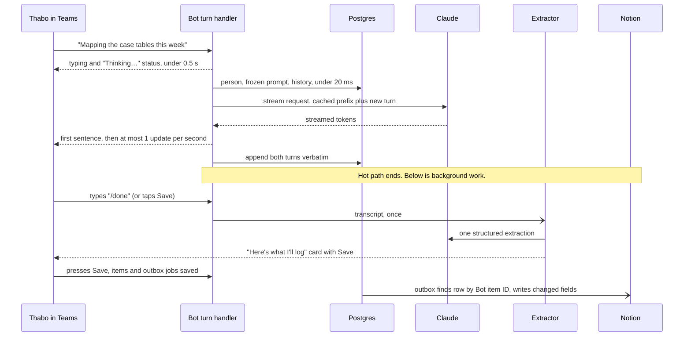

# Weekly Coach bot: design

Agreed after an independent expert review (October 2026). Examples use the fictional team in `config/team.sample.yaml`: Jordan (team lead), Amara, Thabo, Wanjiru, Pieter and Lindiwe. Real names and IDs live only in git-ignored `*.local.yaml` files.

## 1. Summary

One TypeScript service (Node 22) helps each person plan their week against the team's OKRs (objectives and key results).

- **Monday, 08:30 local time:** a direct message (DM) in Microsoft Teams lists last week's unfinished items ("Do you plan to finish this off?"), then coaches one question at a time towards at most three outcomes: for each, what is handed to whom by Friday, one blocker check, which key result (KR) it supports, and the first step. It stays at the level of what, not how, and never does the work.
- **Wednesday and Friday:** a short check-in and a review.
- **The team:** one Monday summary in the existing OKR meeting group chat.
- **Quiet weeks:** two nudges, a heads-up showing the exact line the manager would get, then that line, copied to the person. "Stuck" reaches the manager only with consent.
- **Records:** plans go to a new Notion database; the curated OKR tracker changes only after a confirm button.
- **Speed:** a chat turn touches only the local database and Claude's stream, so first words appear in about 2 seconds.
- **Swappable parts:** Teams, Notion, Microsoft Graph and Claude sit behind interfaces, so Phases 1–4 need no IT approval.

## 2. Diagrams


One chat turn; the person waits only on the "hot path" above the note.



## 3. Components and repo layout

The **turn handler** checks the sender, loads the conversation, streams the reply and appends both turns. The **router**, **week cycle** and 60-second **scheduler** are plain code. The **extractor** runs once per plan. The **outbox worker** writes to Notion; **OKR sync** copies the tracker every 10 minutes.

```
config/    team.sample.yaml bot.yaml notion.sample.yaml   (real: *.local.yaml, git-ignored)
prompts/   coach.md extraction.md
fixtures/  q4-tracker.sample.json                         (fictional)
eval/      personas.json refusal-prompts.json judge.md simulated-user.md
scripts/   chat.ts eval.ts report.ts simulate-week.ts notion-check.ts
           notion-create-weekly-db.ts link-users.ts
src/       main.ts config.ts clock.ts
  domain/ ports/ core/ policy/ scheduler/ store/ workers/
  adapters/  console/ teams/ anthropic/ scripted/ notion/ graph/ config/ jsonFile/
```

## 4. Ports and adapters

A port is a TypeScript interface; an adapter is one implementation of it. The `Store` port (repositories plus `tx()`) is async from day one: PGlite (Postgres running inside Node) locally and in tests, `pg` in production.

```ts
export interface LLMPort {
  streamTurn(req: TurnRequest, onText: (delta: string) => void, signal?: AbortSignal): Promise<TurnResult>;
  extract<T>(schema: z.ZodType<T>, transcript: string): Promise<T | null>;   // Phase 2, once per Save
}
export interface ReplyStream {
  status(text: string): Promise<void>;   // typing + "Thinking…" before any text
  push(delta: string): void;             // buffered: first sentence, then ≤1 update/s
  end(): Promise<SentRef>;
  replace(text: string): Promise<void>;  // swap streamed text for the refusal redirect
}
export interface MessagingPort {
  start(h: {
    onMessage(e: InboundMessage, r: ReplyStream): Promise<void>;  // has aadObjectId, tenantId
    onCardAction(e: CardAction): Promise<CardSpec | void>;        // code only, under 500 ms
    onInstall(e: InstallEvent): Promise<void>;                    // saves the conversation reference
  }): Promise<void>;
  sendDirect(personId: string, m: TextOrCard): Promise<SentRef>;
  postToChat(chatKey: string, markdown: string): Promise<SentRef>;
  edit(ref: SentRef, m: TextOrCard): Promise<void>;
}
export interface PlanningStorePort {     // Notion; never on the hot path
  listOkrRows(): Promise<OkrRow[]>;
  findPlanItemByKey(botItemId: string): Promise<string | null>;
  upsertPlanItem(i: PlanItemRecord, changedFields: string[]): Promise<{ pageId: string }>;
  applyTrackerChange(s: ConfirmedSuggestion): Promise<"applied" | "stale">;
}
export interface AvailabilityPort {
  week(p: Person, weekStart: string): Promise<DayStatus[]>;   // working | away | holiday | non_working
  awayNow(p: Person): Promise<"working" | "away" | "unknown">;
}
```

| Port | Ph 1 | Ph 2 | Ph 3 | Ph 4 | Ph 5 |
|---|---|---|---|---|---|
| LLM | `ClaudeLLM` | + `extract` | same | `ScriptedLLM` in simulations | same |
| Messaging | console | console | console | `TeamsMessaging` in Agents Playground | Teams, hosted |
| Store | memory | `PgStore` on PGlite | same | same | Azure Postgres |
| PlanningStore | fixture file | same | `NotionPlanningStore` | same | same |
| Directory | `team.yaml` | same | same | same | + `link-users` IDs |
| Availability | none | none | none | `date-holidays` + `/away` | + `GraphAvailability` |

## 5. Data model

**Master copies.** OKRs live in the Notion tracker (Postgres keeps a read-only copy). Plans and bot state live in Postgres; Weekly Plans in Notion is the copy people read. Transcripts go only to the Claude application programming interface (API).

**Postgres tables** (Postgres-dialect SQL, e.g. `INSERT … ON CONFLICT DO NOTHING`):

| Table | Key columns | Phase |
|---|---|---|
| `people` | aad_object_id, email, notion_user_id, tz, country, working_days, manager_id, coach_notes (written by the person, at most 300 characters) | 2 |
| `okr_rows` | page_id, type, kr_code, name, status, blocked, current_state, due, owners, source | 2 |
| `plan_items` | Bot item ID, person, week, title, kr_code, carried_from, carry_count, done_looks_like (the handover), handed_to, first_step, blockers, status, friday_outcome, share, ask_team, confirmed | 2 |
| `weeks`, `checkins` | state per person-week; check-in answers | 2 |
| `conversations`, `messages` | frozen system prompt; `messages` is **append-only** (a trigger rejects UPDATE and DELETE; only the purge removes whole conversations) | 2 |
| `turn_metrics` | first_text_ms, cache_read_tokens, token counts | 2 |
| `outbox`, `tracker_suggestions` | unique job key; old and new value, confirmed_by | 3 |
| `touchpoints` | UNIQUE(person, week, kind, seq), due_utc, valid_until_utc, state, sent_ref | 4 |
| `manager_notes` | kind (no_plan / stuck / swamped), text, hold_until, state | 4 |
| `away`, `conversation_refs`, `team_posts` | leave dates; Teams chat references; summary message ID | 4 |
| `audit_events` | who, what, when; never message content | 4 |

**Notion "Weekly Plans & Check-ins"** (one row per item per week; one database per quarter):

| Property | Type | Purpose |
|---|---|---|
| Item | title | "Thabo · 2026-W43 · Map case tables" |
| Person / Week of | people / date | Owner; first day of the week |
| Status | status | Planned, In progress, Blocked, Done, Partly, Carried over, Dropped |
| KR | relation, `single_property` | Link to the KR row, with no back-column added to the tracker |
| KR code | rich_text | Readable after the quarter changes |
| Done looks like, Handed to, First step, Blockers | rich_text | Done looks like is the handover; Blockers truncated at Notion's 2,000-character limit |
| Blocker type | multi_select | Access, Data, People, Decision, Setup, Time |
| Mid-week update, Friday outcome | rich_text | Dated lines |
| Carried over from | self-relation | Added after the database exists |
| Confirmed by person | checkbox | Unticked = draft |
| Bot item ID | rich_text | Looked up before creating, so no duplicates |

The page is restricted to the team. The outbox sends only changed fields, so hand edits elsewhere survive.

**Config** (checked at start-up by Zod, a validation library):

```yaml
# config/bot.yaml
replyMode: stream                      # stream | single
workingHours: { start: "08:00", end: "17:00" }
extraHolidays: { KE: [], ZA: [] }      # short-notice public holidays
ladder:   # [working day of the person's week, local time]
  { opener: [1, "08:30"], nudge1: [1, "13:30"], nudge2: [2, "09:30"], headsUp: [3, "09:30"], managerNote: [4, "10:00"] }
checkins: [{ day: WED, time: "10:00", nudgeAfter: 3h }]
review:   { day: LAST_WORKING_DAY, time: "14:00", nudgeAfter: 3h }
summary:  { chat: okr-meeting, day: MON, time: "14:00", tz: Africa/Johannesburg, editUntil: "WED 12:00" }

# config/notion.local.yaml (git-ignored)
notionVersion: "2026-03-11"
trackerWriteMode: off                  # off | dry-run | live
okrTracker:  { dataSourceId: "<id>", fields: { … }, suggestable: [Status, Blocked, Current state] }
weeklyPlans: { dataSourceId: "<id>" }
```

`team.local.yaml` adds each person's country, working days and email. `fields` maps the tracker's columns (one table of KR and Task rows: Type, Objective, KR code, Parent KR, Status, Blocked, Blocked by, Current state, Description, Due, Primary/Secondary owner, Source) to the bot's names. Source = Proposed or Rejected rows are filtered out everywhere.

## 6. The week, routing and coaching

**State per person per week**, moved by code, never by the model:

```
SCHEDULED → OPENER_SENT → PLANNING → PLAN_SAVED | DRAFT_SAVED
  → CHECKIN_SENT → CHECKIN_DONE → REVIEW_SENT → CLOSED
OPENER_SENT → NUDGED_1 → NUDGED_2 → HEADS_UP → NOTE_SENT
any → AWAY | SKIPPED
```

Planning, check-in and review are separate Claude conversations, each started fresh from Postgres.

**Routing rules:**
1. A message joins this week's open conversation while it is valid (planning until Wednesday 12:00; check-in and review until day's end).
2. Otherwise it starts late planning (before Wednesday 12:00, no plan) or a short "update" conversation for news and new blockers.
3. A button pressed after its touchpoint closed changes nothing; the card says "This one has expired."
4. No check-in without a plan or draft, and none on a heads-up day. A review with no plan is one light question.
5. Commands: `/plan`, `/away 2026-10-21..23`, `/skip`, `/mine`, `/help`.
6. One turn per person at a time; messages arriving meanwhile join the next turn.

**Carry-overs.** Last week's items not Done or Dropped, plus "In progress" tracker Tasks the person owns: at most three, by due date, with [Finish it] [Carry part of it] [Already done] [Drop it]. "Carry part" closes the old item as Partly and links a new one. "Already done" offers a tracker suggestion. A third carry-over prompts a re-scope offer; a new quarter's first Monday offers a KR picker.

**Coaching.** The team's remit comes from `team.yaml` and is shown with the OKRs; `prompts/coach.md` holds the rules: one question per message, at most 80 words; reflect back and offer options; never do the task or decide for the person. The order is: carry-overs, then "If it's Friday and the week went well, what's true?" (at most three outcomes, reflected back for correction), then per outcome: done as a handover (what goes to whom, by when), one blocker question (access, people, decisions, data, time), KR link, and the first step only. Only in a heavy week does it ask about focus time, what to drop and who else could take something. The coach then recaps one line per outcome ("handover (KR)") and ends "If that's too much, say what to cut. Otherwise type /done." (a Save button in Teams); one extraction builds the Save card (items, changeable KR, handover, blockers, a "share" tick, [Save] [Change something]). No click in two working hours saves a draft. Button choices enter the chat as a line from the person, e.g. `[Chose: Finish "Map case tables"]`.

**Lessons from a manual trial (October 2026).** The team lead planned a real week with a general-purpose assistant playing a "chief of staff". What worked became coaching rules:
- Stay at the top level: what, for whom, by when. Questions about method went too far.
- Quality is the person's call. "When I'm happy with it" closes that question; the coach asks only where the work goes next.
- Done means handed over (sent for comment, sign-off or use), because that is what others can see on Friday.
- First step only, never the recipe. Whole projects get "what slice could be handed over this week?"; tiny admin becomes one "quick admin" line.
- Read dictated words charitably and say the reading in passing so the person can correct it. When the person is confused, restate plainly and offer options.
- Never fill in an outcome; rewording and asking for confirmation is fine.
- The person's own coaching preferences ("stay top level") should carry over to next week: Phase 2 stores them as `coach_notes`, written by the person at the Friday review or through `/mine`, never inferred by the model.

The trial also scanned the person's mail, chats, calendar and Notion pages before coaching. It made for sharper questions but needed broad access and took several minutes and hundreds of thousands of tokens per source. The bot does not do this (decision 15); see section 16.

**Examples:**
- Opener: "Hi Thabo, new week. Let's sketch it out together. These are still in progress on the tracker: *Map case tables* (KR 2.1) and *Data-quality tests* (KR 2.3). Which of these do you plan to finish off this week?" Only in-progress tasks are offered; for a longer-running one the coach asks what progress this week looks like rather than whether to finish or drop it.
- Coaching: "Nice, so the mapping is the big one. If it goes well, what could you show Wanjiru on Friday?"
- KR: "This sounds like KR 2.1, the case data model. Does that fit?"
- Check-in: "Hi Amara, quick check-in. How's *Audit log access request* going?" [On track] [Slower than hoped] [Stuck] [Done]
- Review: "Happy Friday, Wanjiru. How did *Labelling guide* land?" [Done] [Partly] [Didn't start] [Dropped]
- Nudge: "No rush, Lindiwe. If now isn't great, three quick bullets is plenty." [Plan now] [Light week] [Skip this week]

## 7. Scheduler, time zones, holidays and sending once

- **Time.** `tick.ts` runs every 60 seconds on a fake-able `Clock`. Each person has a standard time-zone name: `Africa/Johannesburg` (South Africa Standard Time, SAST) or `Africa/Nairobi`. Server jobs use Coordinated Universal Time (UTC).
- **`prepareWeek`** runs at 04:30 UTC on Monday, and on start-up if missed. It syncs OKRs, works out working days and inserts touchpoints with `ON CONFLICT DO NOTHING`, so reruns are harmless.
- **Holidays.** `date-holidays` for South Africa (ZA) and Kenya (KE), plus `extraHolidays` for short-notice ones. Ladder days are working days: in the week of 19 October, Amara's day 2 is Wednesday (Tuesday is Mashujaa Day).
- **Out of office (OOF).** Phase 4: `/away`. Phase 5 adds Microsoft Graph: `getSchedule` once a week and `outOfOfficeSettings.isOutOfOffice` just before each send. A Graph failure means "unknown": no nudge, no manager note. The same weekly `getSchedule` result gives one line for the coach's context note ("About 14 free hours this week; away Thursday"), written by `prepareWeek`, never fetched during a chat. Only free/busy is used, never event titles or bodies.
- **Rules.** Leave on day 1 moves the opener; steps after the last working day are dropped; nothing goes out of hours.
- **Joiners and leavers.** `team.yaml` changes apply at the next `prepareWeek`; a leaver's open items become Dropped and their touchpoints are cancelled.
- **Exactly once.** A touchpoint is claimed with `UPDATE … SET state='sending' WHERE id=$1 AND state='due'`, sent, then marked `sent`. After a crash, `sending` becomes `sent_unknown` and is **never resent**. Past `valid_until` it becomes `expired`. People with no Teams conversation are `unreachable` (shown in the ops DM).
- **One scheduler.** Deployments can briefly run two replicas, so the tick runs only while holding a Postgres advisory lock.
- **Outbox.** Unique job keys; `findPlanItemByKey` before every create (Notion has no idempotency keys); at most 2 requests per second, honouring `Retry-After`.

## 8. Nudges, escalation and the team summary

Times assume a Monday start, in the person's local time. Any reply or button press stops the ladder.

| Step | When |
|---|---|
| Opener | Day 1, 08:30 |
| Nudge 1 | Day 1, about 13:30 (four working hours on) |
| Nudge 2 | Day 2, 09:30 |
| Heads-up | Day 3, 09:30, with [Doing it now] [Tell my manager I'm swamped] [Skip this week] |
| Manager note | Day 4, 10:00, to the manager, copied to the person; at most one per person per week |

Heads-up: "Hi Lindiwe, I haven't caught you this week, and that's fine; weeks get busy. If I don't hear from you by Thursday 10:00, I'll send Jordan just this line: *'Lindiwe hasn't had a chance to plan this week yet.'* Nothing else is shared."

- **Check-ins and the review** get one nudge three working hours later, then expire; they never escalate.
- **[Skip this week]** stops everything. "Swamped" sends "Lindiwe is swamped this week and will plan when she can", copied to her.
- **Stuck is consent-only.** Offered on a [Stuck] tap, the same blocker at two touchpoints in a row, or a third carry-over: "The telemetry extract is still holding you up, Pieter. Would a note to Jordan help? You write it, I send it as is, and you get a copy." At most two lines, editable.
- **Manager away** (leave, OOF, or Graph unknown): a no-plan note waits for the manager's first working day back, or is dropped if the week has closed. A stuck note waits; the person hears the return date and gets [Ask the team]. No deputy.
- Jordan's own items never escalate; the manager never sees transcripts; every send is audited.

**Team summary.** Built in code, not by the model: one message at Monday 14:00 SAST in the existing OKR meeting group chat (`groupChat` scope), edited in place as late plans arrive until Wednesday 12:00.

```text
Week of 12 Oct: what we're on
Last week: 9 done · 3 partly · 2 carried over
Amara: Audit log access request (KR 1.1) · 500-case sample design (KR 1.2)
Thabo: Map case tables (KR 2.1)
Pieter: Away
Could use help: Thabo is looking for someone who knows the case system's audit tables.
KRs with nothing planned: 1.3, 3.3, 4.3
```

Help requests appear only via [Ask the team]. Never shown: who hasn't planned, nudges, blocker detail, leave reasons.

**Your own update (Phase 4).** After Save, [Copy my update] gives the person a fixed-format text to edit and post themselves: "What I'm working on this week" (one line per outcome, written as the handover and when) and "What I need help with" (named asks). The bot never posts as a person; a Teams bot can only post as itself (decision 16).

## 9. Latency

| Step | Budget | Notes |
|---|---|---|
| Teams → global Bot Connector → app in South Africa North | 150–400 ms | |
| Verify token, tenant, team list | <10 ms | Keys cached |
| Typing and "Thinking…" status | sent in 50 ms | Seen within 0.5 s |
| Load conversation from Postgres | <20 ms | |
| South Africa → Anthropic API (US) round trip | 250–350 ms | Kept-alive connection |
| Model to first text (warm cache, effort `low`) | 0.5–1.2 s | Measured in Phase 1 |
| Teams' limit: one streaming update per second | 0–0.5 s | The status counts, so text follows it by ≥1 s |
| App → Teams | 150–300 ms | |
| **Server-measured first text** | **p50 ≤2.0 s, p95 ≤3.5 s** | Median, 95th percentile |
| Button → updated card | <300 ms | Code only |

The person also sees the two Teams legs (0.3–0.7 s). With no text after 10 s, the bot shows "Still thinking…", retries once outside the turn and sends a new message. Streams end at 12 s, inside the Bot Service turn timeout. `replyMode: single` turns streaming off.

**Chat request** (exact):

```ts
client.messages.stream({
  model: "claude-sonnet-5-5",
  max_tokens: 16000,                                  // backstop; length is set in coach.md
  thinking: { type: "adaptive" },
  output_config: { effort: "low" },                   // fixed per conversation
  cache_control: { type: "ephemeral", ttl: "1h" },    // automatic marker on the growing tail
  system: [
    { type: "text", text: coachPrompt, cache_control: { type: "ephemeral", ttl: "1h" } },
    { type: "text", text: okrSnapshot, cache_control: { type: "ephemeral", ttl: "1h" } },
  ],
  messages: [
    { role: "user", content: [{ type: "text", text: personContext,
        cache_control: { type: "ephemeral", ttl: "1h" } }] },
    { role: "assistant", content: openerText },       // template opener, stored verbatim
    ...history,                                       // append-only, assistant content verbatim
    { role: "user", content: `[Tue 20 Oct 2026, 09:12 Africa/Nairobi]\n${userText}` },
  ],
}, { signal });
// No tools, no beta headers, no fallbacks, no role:"system" messages in Phases 1-2.
```

- The OKR snapshot is frozen per conversation (sorted, no edit times). A 1-hour cache entry lapses after an hour unread, so a weekly freeze gains nothing.
- The stored date line keeps a two-day conversation correct without editing history.
- Extraction at Save: `client.messages.parse`, same model, effort `low`, Zod output format.
- Eval: judge `claude-opus-5-5`; simulated team member `claude-sonnet-5-5`.
- Cost: roughly $5–15 a month.

## 10. Refusal handling

Claude can decline a request (`stop_reason: "refusal"`). This team discusses fraud all day, so false alarms are the risk.

1. The team's remit (from `team.yaml`, shown with the OKRs) states the legitimate work: detecting, measuring and preventing fraud against the company and its customers; `coach.md` tells the coach to read the team's own vocabulary in that light.
2. The partial text is discarded (replaced in Teams) and the bot says: "Let's keep this to the plan itself. What would done look like for that piece by Friday?" Only the category is logged. The refused message stays out of the model's history: a neutral stand-in ("The person described a work item; details left out.") and the redirect are recorded instead, so the triggering text is never re-sent.
3. After a second refusal in one conversation, a card capture with no model takes over: title, KR picker, blocker type.
4. Server-side fallback is **off**: it retries only two categories, on a different model, and not "general harms", this team's likely false alarm.
5. Phase 1 runs 20 fraud-vocabulary planning messages; the target is zero refusals.

A Claude outage, or an HTTP 400 for changed history (a bug), also switches to card capture and shows in the ops DM.

## 11. Privacy and data protection

Work chats are personal information under South Africa's Protection of Personal Information Act (POPIA) and Kenya's Data Protection Act 2019. Sending them to Anthropic in the US is a cross-border transfer under both (POPIA section 72; Part VI of the Kenyan Act). The data-protection officer (DPO) decides; this design supplies the facts.

**Gate before anyone but the team lead chats:** the API key belongs to the company's Anthropic organisation, in its own workspace, retention setting recorded; a one-page staff notice is filed; Weekly Plans is restricted to the team. Until then only the team lead's own chats and the fictional fixture are used.

**The bot never reads** anyone's mail, chats or files. It reads the OKR tracker, the person's own replies and, from Phase 5, calendar free/busy and out-of-office status.

**The notice covers:** what is logged; the coaching notes you write yourself; who sees what (you: all of yours; the team: shared titles and KR codes; the manager: Weekly Plans rows and notes you saw first; nobody: transcripts); the 90-day transcript purge; Anthropic (US) as processor; Microsoft's global Bot Service; how to see or delete your data.

**Retention, for DPO sign-off:** transcripts 90 days; plan items and Notion rows kept as work records; audit events and metrics (no content) 12 months.

**`/mine`** shows what the bot holds about you, with [Send me my transcripts] and [Delete my transcripts]. Plan rows are team records the team lead removes on request.

## 12. Operations

- **Health.** `/healthz` checks the database, last tick and outbox backlog; an Azure availability test pings it.
- **Daily ops DM** to the team lead at 08:00 SAST, counts only: outbox dead letters, `sent_unknown` and `unreachable` rows, Notion errors, refusals by category, p95 latency, month-to-date Claude spend, days to secret expiry.
- **Spend cap** on the Anthropic workspace.
- **Backups.** Built into Azure Database for PostgreSQL, with point-in-time restore; one restore is tested in Phase 5.
- **Secrets.** Git-ignored `.env` and a pre-commit secret scan locally; Key Vault via managed identity in production. The Microsoft Entra app's client secret lasts at most 24 months; the ops DM warns from 30 days out and a named owner rotates it.
- **Hosting.** Azure Container Apps (exactly 1 replica) and Azure Database for PostgreSQL Flexible Server (Burstable B1ms) in South Africa North, about $40–70 a month.

## 13. Phases

Each check passes before the next phase starts.

**Phase 1: coaching spike in a terminal.** `coach.md`, the fictional fixture, `ClaudeLLM.ts`, `chat.ts`, `eval.ts`.
How you'll know it worked: `npm run chat -- --as amara` asks one short question at a time. `npm run eval` reports at least 11 of 12 personas passing (one question per message, ≤80 words, never does the task, stays at the top level, frames done as a handover, reaches a KR link), 0 of 20 refusals, and p50 first text ≤2.0 s over at least 30 turns, labelled "laptop, not hosted".

**Phase 2: remembers the week, in the terminal.** PGlite store, carry-overs, Save card with one extraction (outcome, handover, handed to, first step, KR), per-conversation snapshot, date line, routing rules, and the person's own `coach_notes` in the cached context.
How you'll know it worked: Save twice, then `npm run report -- --as thabo` shows each item once. `--touchpoint checkin` names your items; `--week next` asks "Do you plan to finish this off?" `npm test`: at least 4 of 5 saved transcripts extract the right KR.

**Phase 3: Notion log.** Gate: a Notion internal connection from the workspace owner (a personal token on a private test page works for development).
How you'll know it worked: `npm run notion:check` prints "OK: N KRs, M Tasks, all fields found" and the Proposed/Rejected rows skipped. After `npm run notion:create-db`, a saved plan appears within 30 s, its KR cell opens the KR row, and hand edits survive the next save. Suggestions go `off`, `dry-run` (change shown and audited, tracker untouched), then `live`; a row hand-edited before Apply gets a fresh offer.

**Phase 4: scheduler, nudges, Teams in the Agents Playground.**
How you'll know it worked: `npm run simulate-week -- --start 2026-10-19 --away pieter:2026-10-21..23 --silent lindiwe` (fake clock, `ScriptedLLM`, offline) prints a local-time timeline: Kenyan ladders skip Mashujaa Day; Lindiwe gets two nudges, the heads-up, then Jordan's note Thursday 10:00; the summary is edited for a late plan. With `--away jordan:2026-10-22..23` the note is held, then dropped. Rerunning or killing midway sends nothing twice. In the Agents Playground (`PLAYGROUND=1`) cards and buttons work; without it or `CLIENT_ID`/`TENANT_ID` the bot won't start; an unlisted user gets the team-only reply. After Save, [Copy my update] gives the fixed-format "What I'm working on / What I need help with" text. The first opener after `/away` says welcome back and asks what from the time away needs doing, handing off or dropping.

**Phase 5: hosted pilot.** Gate: IT approval (`docs/ask-IT.md`) and the staff notice.
How you'll know it worked: the Monday DM arrives unprompted at 08:30; status within 0.5 s; first text p50 ≤2.0 s, p95 ≤3.5 s over week one; an all-day OOF event stops that day's nudge; the ops DM arrives with the secret-expiry countdown; `/healthz` is green; a backup restores; the purge removes a 90-day-old test transcript.

## 14. Decisions log

All confirmed by the independent expert review.

1. Chose the **Claude API directly**, under the company's Anthropic account, over Azure AI Foundry, because Foundry needs extra approval and a second code path.
2. Chose **identity from the verified `from.aadObjectId`** (the sender's Microsoft Entra ID) over full single sign-on (SSO), because nothing acts as the user and nobody should see a login prompt. Guards: no start without `CLIENT_ID`/`TENANT_ID` unless `PLAYGROUND=1`; other tenants rejected; only `team.yaml` members served. `link-users` maps aadObjectId → email → Notion user.
3. Chose **consent-only stuck notes and a visible heads-up** over automatic escalation, because trust matters more than speed.
4. Chose **no deputy** over a stand-in manager, because notes should reach only the person the team member expects.
5. Chose **the existing OKR meeting chat** over a new channel, because the team already looks there.
6. Chose **server-side fallback off** over on, because it misses the likely false-alarm category and silently switches models.
7. Chose **Container Apps plus managed Postgres** over a VM, because nobody patches a server and backups are built in.
8. Chose **Postgres SQL and an async store from day one** over SQLite, so going live changes a connection string, not call sites.
9. Chose **one extraction at Save** over one per turn, because it removes most of the cost and a moving part.
10. Chose **a per-conversation snapshot** over a weekly one, because the cache does not survive between days.
11. Chose **off → dry-run → live tracker writes** over a sandbox copy, because a copy changes every page ID. Stale checks compare field values, not edit times.
12. Chose **one Weekly Plans database per quarter** over a new relation column each quarter, because columns would pile up.
13. Chose **template openers and a code-built summary** over model-written ones, because they are instant and cannot misstate last week.
14. Chose **never resending an unsure message** over resending, because a duplicate costs more trust than a late nudge.
15. Chose **no mail, chat or file scan before coaching** over a per-person briefing, because it needs read access to every mailbox and chat, pulls in personal items (pay, leave, HR), costs far more than the coaching itself, and a team bot reading staff mail is the "watched, not coached" risk made real. Last week's plan and review, the tracker, and (Phase 5) calendar free time give the coach its facts instead.
16. Chose **a copyable update the person posts themselves** over the bot posting on their behalf, because a Teams bot can only post as itself and the person's own words should win.
17. Chose **coaching notes written by the person** over notes the model infers, because silent profiling would undermine trust.

## 15. Risks

| Risk | Mitigation |
|---|---|
| South Africa → US latency over budget | Measured in Phase 1; thinking off (`between_tools`) |
| IT or the DPO says no | It stays a terminal tool |
| The team feels watched, not coached | Agree the ladder first; consent-only notes; [Skip this week] |
| Fraud vocabulary triggers refusals | Remit in `coach.md`, refusal test set, card capture |
| Teams streaming differs from the Playground | `replyMode: single` |
| Wrong KR at Save | Changeable on the card |
| Shared Notion rate limit | 2 requests/s, `Retry-After`, plan tier confirmed |
| Secret expires unnoticed | Ops DM countdown, named owner |

## 16. Deliberately not built

A Foundry code path; server-side refusal fallback; per-turn extraction, one-turn system notes, cache pre-warming; a sandbox tracker copy; two-way Notion sync or webhooks (polling is enough); OAuth sign-in; a deputy manager; automatic stuck escalation; model-written openers, summaries or team posts; a scan of mail, Teams chats or Notion pages before coaching (a personal, opt-in assistant using the person's own sign-in would be a separate product with its own impact assessment); tools on the hot path; queues, Redis, microservices, extra replicas; a dashboard.
