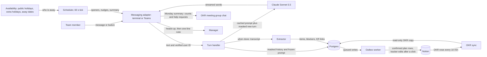
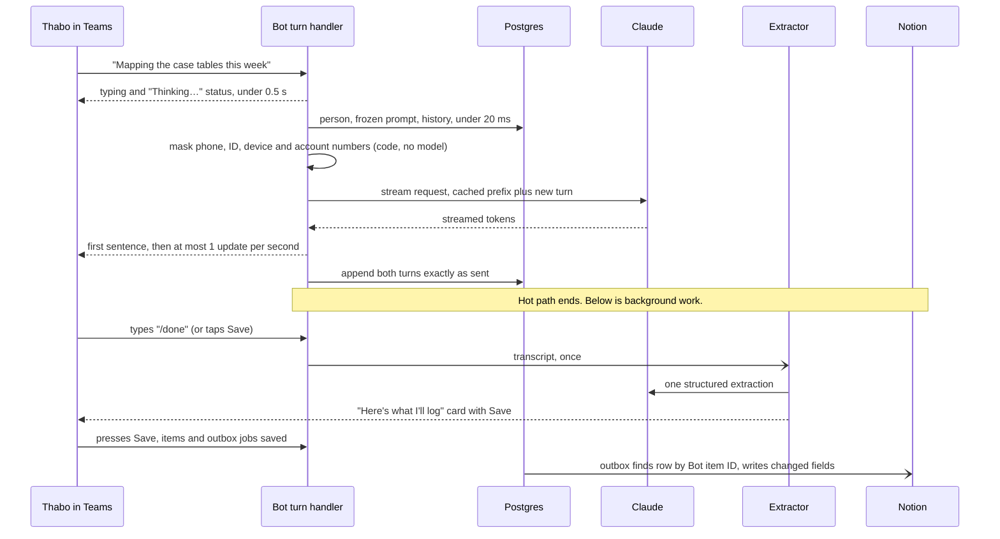

# Weekly Coach bot: design

Agreed after an independent expert review (October 2026), then revised the same month after a 23-item design review and a plan for Jev, a fast yes/no classifier (section 9). Examples use the fictional team in `config/team.sample.yaml`: Jordan (team lead), Amara, Thabo, Wanjiru, Pieter and Lindiwe. Real names and IDs live only in git-ignored `*.local.yaml` files.

## 1. Summary

One TypeScript service (Node 22) helps each person plan their week against the team's OKRs (objectives and key results).

- **Monday, 08:30 local time:** a direct message (DM) in Microsoft Teams lists last week's unfinished items ("Do you plan to finish this off?") and says three quick bullets are plenty. The coach then asks one question at a time, towards at most three outcomes, with at most two questions per outcome: what is handed to whom by Friday, and one blocker check. It names the key result (KR) in passing or proposes it in the closing recap, and asks for a first step only if the person is stuck. It stays at the level of what, not how, and never does the work.
- **Wednesday and Friday:** a short check-in and a review.
- **The team:** one Monday summary in the existing OKR meeting group chat, with counts, help requests and KRs with nothing planned. It lists nobody's plan by name; a help request appears only if the person chose to share it.
- **Quiet weeks:** two nudges, a heads-up showing the exact line the manager would get, then that line, copied to the person. "Stuck" reaches the manager only with consent.
- **Records:** confirmed plans go to a new Notion database; the curated OKR tracker changes only after a confirm button.
- **Speed:** a chat turn touches only the local database and Claude's stream, so first words appear in about 2 seconds. Fewer questions matter more: a three-item plan should take under five minutes from opener to Save.
- **Swappable parts:** Teams, Notion and Claude sit behind interfaces, so most of the bot can be built and tested in a terminal.
- **Approvals:** Phases 1–2 need no approvals; Phase 3 needs a Notion workspace owner; Phase 5 needs IT (Microsoft Entra, the company's sign-in directory; Teams admin; Azure), the data-protection officer (DPO) and an Anthropic workspace. The pilot needs no Microsoft Graph permissions. Requests start now, because approvals take time; `docs/ask-IT.md` lists each one with its owner and the date asked.
- **Checks:** an evaluation script (the eval) runs the coach against 13 fictional personas, with Claude Opus 5.5 as judge. Jev, a fast yes/no classifier from TypeSafe AI, gives a cheap check on each reply while the coaching prompt is tuned. Jev does not make the chat faster (section 9).

## 2. Diagrams



One chat turn; the person waits only on the "hot path" above the note.



Masking starts in Phase 2. Nothing else waits on the person's turn: a Jev check (section 9) would run only after the reply has been sent.

## 3. Components and repo layout

The **turn handler** checks the sender, loads the conversation, streams the reply and appends both turns. The **router**, **week cycle**, 60-second **scheduler** and **masker** (Phase 2: hides phone, ID, device and account numbers) are plain code. The **extractor** runs once per plan. The **outbox worker** writes to Notion; **OKR sync** copies the tracker every 10 minutes. The **reply checker** asks Jev five yes/no questions about one coach reply; for now only the eval uses it.

```
config/    team.sample.yaml bot.yaml notion.sample.yaml   (real: *.local.yaml, git-ignored)
prompts/   coach.md extraction.md
fixtures/  q4-tracker.sample.json                         (fictional)
eval/      personas.json refusal-prompts.json judge.md simulated-user.md
           jev-questions.json jev-label.md jev-seed.json jev-calibration.json bad-coach/
scripts/   chat.ts eval.ts jev-label.ts jev-eval.ts report.ts simulate-week.ts
           notion-check.ts notion-create-weekly-db.ts quarter-rollover.ts link-users.ts
data/      eval results and the Jev gold set               (git-ignored)
src/       main.ts config.ts clock.ts
  domain/ ports/ core/ policy/ scheduler/ store/ workers/ eval/
  adapters/  console/ teams/ anthropic/ jev/ scripted/ notion/ config/ jsonFile/
             graph/ (optional, Phase 6)
```

## 4. Ports and adapters

A port is a TypeScript interface; an adapter is one implementation of it. The `Store` port (repositories plus `tx()`) is async from day one: PGlite (Postgres running inside Node) locally and in tests, `pg` in production.

```ts
export interface LLMPort {
  streamTurn(req: TurnRequest, onText: (delta: string) => void, signal?: AbortSignal): Promise<TurnResult>;
  extract<T>(schema: z.ZodType<T>, transcript: string): Promise<T | null>;   // Phase 2, once per Save
}
export interface ReplyStream {
  status(text: string): Promise<void>;   // typing + "Thinking…" before any text
  push(delta: string): void;             // buffered: first sentence, then ≤1 update/s
  end(): Promise<SentRef>;
  replace(text: string): Promise<void>;  // swap streamed text for the refusal redirect
}
export interface MessagingPort {
  start(h: {
    onMessage(e: InboundMessage, r: ReplyStream): Promise<void>;  // has aadObjectId, tenantId
    onCardAction(e: CardAction): Promise<CardSpec | void>;        // code only, under 500 ms
    onInstall(e: InstallEvent): Promise<void>;                    // saves the conversation reference
  }): Promise<void>;
  sendDirect(personId: string, m: TextOrCard): Promise<SentRef>;
  postToChat(chatKey: string, markdown: string): Promise<SentRef>;
  edit(ref: SentRef, m: TextOrCard): Promise<void>;
}
export interface PlanningStorePort {     // Notion; never on the hot path
  listOkrRows(): Promise<OkrRow[]>;
  findPlanItemByKey(botItemId: string): Promise<string | null>;
  upsertPlanItem(i: PlanItemRecord, changedFields: string[]): Promise<{ pageId: string }>;
  applyTrackerChange(s: ConfirmedSuggestion): Promise<"applied" | "stale">;
}
export interface AvailabilityPort {
  week(p: Person, weekStart: string): Promise<DayStatus[]>;   // working | away | holiday | non_working
  awayNow(p: Person): Promise<"working" | "away" | "unknown">;
}
export interface ClassifierPort {        // Jev; never on the hot path, never a decision about a person
  flagReply(x: ReplyExchange, signal?: AbortSignal): Promise<FlagResult | null>;   // null = "unknown"
}
```

| Port | Ph 1 | Ph 2 | Ph 3 | Ph 4 | Ph 5 |
|---|---|---|---|---|---|
| LLM | `ClaudeLLM` | + `extract` | same | `ScriptedLLM` in simulations | same |
| Messaging | console | console | console | `TeamsMessaging` in Agents Playground | Teams, hosted |
| Store | memory | `PgStore` on PGlite | same | same | Azure Postgres |
| PlanningStore | fixture file | same | `NotionPlanningStore` | same | same |
| Directory | `team.yaml` | same | same | same | + `link-users` IDs |
| Availability | none | none | none | `date-holidays` + away dates | same (no Graph) |
| Classifier | `JevClassifier`, eval only | same | same | same | + after-the-fact monitor, only if the DPO agrees |

Optional Phase 6 could add `GraphAvailability`, with permissions scoped to the team.

## 5. Data model

**Master copies.** OKRs live in the Notion tracker (Postgres keeps a read-only copy). Plans and bot state live in Postgres; Weekly Plans in Notion is the copy people read. Transcripts go only to the Claude application programming interface (API), with phone, ID, device and account numbers masked from Phase 2. Jev sees only fictional eval transcripts unless the DPO approves the Phase 5 monitor.

**Postgres tables** (Postgres-dialect SQL, e.g. `INSERT … ON CONFLICT DO NOTHING`):

| Table | Key columns | Phase |
|---|---|---|
| `people` | aad_object_id, email, notion_user_id, tz, country, working_days, manager_id, coach_notes (written by the person, at most 300 characters) | 2 |
| `okr_rows` | page_id, type, kr_code, name, status, blocked, current_state, due, owners, source | 2 |
| `plan_items` | Bot item ID, person, week, title, kr_code (empty = business as usual), carried_from, carry_count, done_looks_like (the handover), handed_to, first_step and blocker text (kept here only; Notion gets only the blocker type), status, friday_outcome, share, ask_team, confirmed | 2 |
| `weeks`, `checkins` | state per person-week; check-in answers | 2 |
| `conversations`, `messages` | frozen system prompt, third_party_personal_data (yes/no, from the Save extraction); `messages` is **append-only** (a trigger rejects UPDATE and DELETE; only the 30-day purge removes whole conversations), holds the opener and real chat turns only (never nudges or heads-ups), with identifiers already masked | 2 |
| `turn_metrics` | first_text_ms, cache_read_tokens, token counts | 2 |
| `outbox`, `tracker_suggestions` | unique job key; old and new value, confirmed_by | 3 |
| `touchpoints` | UNIQUE(person, week, kind, seq), due_utc, valid_until_utc, state, sent_ref | 4 |
| `scheduler_lease` | one row: holder, expires_at (90 seconds, renewed every tick) | 4 |
| `inbound_activities` | UNIQUE(activity_id), received_at: a Teams message already seen is skipped | 4 |
| `manager_notes` | kind (no_plan / stuck / swamped), text, hold_until, state | 4 |
| `away`, `conversation_refs`, `team_posts` | leave dates; Teams chat references; summary and help-request message IDs | 4 |
| `audit_events` | who, what, when; never message content | 4 |

**Notion "Weekly Plans & Check-ins"** (one row per item per week; one database per quarter):

| Property | Type | Purpose |
|---|---|---|
| Item | title | "Thabo · 2026-W43 · Map case tables" |
| Person / Week of | people / date | Owner; first day of the week |
| Status | status | Planned, In progress, Blocked, Done, Partly, Carried over, Dropped. Set up by `notion:create-db` through the API; if the API can't set the options, a Select property instead |
| KR | relation, `single_property` | Link to the KR row, with no back-column added to the tracker |
| KR code | rich_text | Readable after the quarter changes; "No KR" for business as usual |
| Done looks like, Handed to | rich_text | Done looks like is the handover |
| Blocker type | multi_select | Access, Data, People, Decision, Setup, Time (the type only; blocker text stays in Postgres) |
| Mid-week update, Friday outcome | rich_text | Dated lines |
| Carried over from | self-relation | Added after the database exists |
| Bot item ID | rich_text | Looked up before creating, so no duplicates |

The page is restricted to the team, and everyone on the team can see every row; the staff notice says so. Only rows the person confirmed with Save are written: drafts, blocker text and first steps stay in Postgres. The outbox sends only changed fields, so hand edits elsewhere survive.

**Config** (checked at start-up by Zod, a validation library):

```yaml
# config/bot.yaml
replyMode: stream                      # stream | single
workingHours: { start: "08:00", end: "17:00" }
extraHolidays: { KE: [], ZA: [] }      # short-notice public holidays
ladder:   # [working day of the person's week, local time]
  # nudge1 at 13:30 is after lunch, five working hours after the opener
  { opener: [1, "08:30"], nudge1: [1, "13:30"], nudge2: [2, "09:30"], headsUp: [3, "09:30"], managerNote: [4, "10:00"] }
checkins: [{ day: WED, time: "10:00", nudgeAfter: 3h }]
review:   { day: LAST_WORKING_DAY, time: "14:00", nudgeAfter: 3h }
summary:  { chat: okr-meeting, day: MON, time: "14:00", tz: Africa/Johannesburg, editUntil: "WED 12:00" }

# config/notion.local.yaml (git-ignored)
notionVersion: "2026-03-11"
trackerWriteMode: off                  # off | dry-run | live
okrTracker:  { dataSourceId: "<id>", fields: { … }, suggestable: [Status, Blocked, Current state] }
weeklyPlans: { dataSourceId: "<id>" }
```

`team.local.yaml` adds each person's country, working days and email. `fields` maps the tracker's columns (one table of KR and Task rows: Type, Objective, KR code, Parent KR, Status, Blocked, Blocked by, Current state, Description, Due, Primary/Secondary owner, Source) to the bot's names. The Primary owner becomes the first entry in `owners`, and only that person is offered a task as a carry-over, so nothing is planned twice. Source = Proposed or Rejected rows are filtered out everywhere.

## 6. The week, routing and coaching

**State per person per week**, moved by code, never by the model:

```
SCHEDULED → OPENER_SENT → PLANNING → PLAN_SAVED | DRAFT_SAVED
  → CHECKIN_SENT → CHECKIN_DONE → REVIEW_SENT → CLOSED
OPENER_SENT → NUDGED_1 → NUDGED_2 → HEADS_UP → NOTE_SENT
any → AWAY | SKIPPED
```

Planning, check-in and review are separate Claude conversations, each started fresh from Postgres.

**Routing rules:**
1. A message joins this week's open conversation while it is valid (planning until Wednesday 12:00; check-in and review until day's end).
2. Otherwise it starts late planning (before Wednesday 12:00, no plan) or a short "update" conversation for news and new blockers.
3. A button pressed after its touchpoint closed changes nothing; the card says "This one has expired."
4. No check-in without a plan or draft, and none on a heads-up day. A review with no plan is one light question.
5. Commands: `plan`, `away`, `skip`, `mine` and `help`, typed with or without a slash, plus a menu card from Phase 4 (section 8 explains why). In the terminal, away dates are typed: `away 2026-10-21..23`.
6. One turn per person at a time; messages arriving meanwhile join the next turn.

**Carry-overs.** Last week's items not Done or Dropped, plus "In progress" tracker Tasks where the person is the primary owner: at most three, by due date, with [Finish it] [Carry part of it] [Already done] [Drop it]. "Carry part" closes the old item as Partly and links a new one. "Already done" offers a tracker suggestion. A third carry-over prompts a re-scope offer; a new quarter's first Monday offers a KR picker. From Phase 4, the first opener after time away starts "Welcome back"; the coach then asks once what from the time away needs doing, handing off or dropping.

**Coaching.** The team's remit comes from `team.yaml` and is shown with the OKRs; `prompts/coach.md` holds the rules: one question per message, at most 80 words; reflect back and offer options; never do the task or decide for the person. The order is carry-overs, then "If it's Friday and the week went well, what's true?" (at most three outcomes, reflected back for correction), then **at most two questions per outcome**:
- **Done means handed over:** what goes to whom by Friday. Skipped if the person has already said.
- **One blocker question:** access or setup, people, decisions, data or other teams, or time. One follow-up about who could unblock it is fine.

Three things never cost a question of their own:
- **The KR.** For a tracker item the coach names its KR in passing ("The mapping is KR 2.1 work. Who gets it on Friday?"). For a new item it puts its best match in the recap with a question mark, "(KR 2.1?)", or "(no KR)" for business as usual such as admin, support or catch-up. It never pushes for a KR; the person confirms it on the Save card.
- **The first step,** asked only if the person seems stuck, the item has slipped before, or they ask how to start.
- **The quick path.** The opener says three quick bullets are plenty. If the person gives the whole plan at once, the coach reflects it back in one line, asks once whether anything is in the way, asks only for missing handovers, then wraps up.

Only in a heavy week does it ask about focus time, what to drop and who else could take something. The coach then recaps one line per outcome ("handover (KR)") and ends "If anything's off or too much, say what to change. Otherwise type /done." (a Save button in Teams). The eval stops each chat at that line and counts how many coach replies it took (section 13, Phase 1).

**Save card (Phase 2).** One extraction builds it: items, the KR (changeable, with "No KR (business as usual)" as a choice), handover, blockers, a "share" tick, [Save] [Change something]. Anything the person never said, which is common after quick bullets, is left blank for them to fill in, not guessed. Business-as-usual items are counted separately and never pushed towards a KR. The extraction also records whether customer or suspect details came up (`third_party_personal_data`; section 11). No click in two working hours saves a draft, in Postgres only, never in Notion. Button choices enter the chat as a line from the person, e.g. `[Chose: Finish "Map case tables"]`.

**Lessons from a manual trial (October 2026).** The team lead planned a real week with a general-purpose assistant playing a "chief of staff". What worked became coaching rules:
- Stay at the top level: what, for whom, by when. Questions about method went too far.
- Quality is the person's call. "When I'm happy with it" closes that question; the coach asks only where the work goes next.
- Done means handed over (sent for comment, sign-off or use), because that is what others can see on Friday.
- First step only, and only when the person is stuck; never the recipe. Whole projects get "what slice could be handed over this week?"; tiny admin becomes one "quick admin" line.
- Read dictated words charitably and say the reading in passing so the person can correct it. When the person is confused, restate plainly and offer options.
- Never fill in an outcome; rewording and asking for confirmation is fine.
- The person's own coaching preferences ("stay top level") should carry over to next week: Phase 2 stores them as `coach_notes`, written by the person at the Friday review or through `/mine`, shown back to them, never inferred by the model.

The trial also scanned the person's mail, chats, calendar and Notion pages before coaching. It made for sharper questions but needed broad access and took several minutes and hundreds of thousands of tokens per source. The bot does not do this (decision 15); see section 16.

A later design review found the flow still too long on a phone: up to five questions per item, so 15–20 questions for a three- or four-item week. Hence the two-question limit, the KR in the recap and the quick path above.

**Examples:**
- Opener (a fixed template, not written by the model):
  ```text
  Hi Thabo, new week. Three quick bullets are plenty, or we can talk it through.
  These are still in progress on the tracker:
  - Map case tables (KR 2.1, due 14 Oct)
  - Data-quality tests (KR 2.3, due 18 Nov)
  Which of these do you plan to finish off this week?
  ```
  Only in-progress tasks where the person is the primary owner are offered, soonest due first. For a longer-running one the coach asks what progress this week looks like rather than whether to finish or drop it. With one task the opener asks "Do you plan to finish this off this week?"; with none, "If it's Friday and the week went well, what's true?"
- Handover, with the KR in passing: "The mapping is KR 2.1 work. Who gets it on Friday?"
- Blocker: "Anything in the way for the mapping: access to the case tables, someone you need, or time?"
- Recap:
  ```text
  - Mapping to Wanjiru for review by Thursday (KR 2.1)
  - Outcome-label field list to Wanjiru for comments by Friday (KR 2.2?)
  - Catch-up emails sorted (no KR)
  If anything's off or too much, say what to change. Otherwise type /done.
  ```
- Check-in: "Hi Amara, quick mid-week check-in. How are things going with this week's plan?" Once plans are saved (Phase 2) it names each item, with buttons in Teams: "How's *Audit log access request* going?" [On track] [Slower than hoped] [Stuck] [Done]
- Review: "Hi Wanjiru, end of the week. How did it land?" Later per item: "How did *Labelling guide* land?" [Handed over] [Partly] [Didn't start] [Dropped]
- Nudge: "No rush, Lindiwe. If now isn't great, three quick bullets are plenty." [Plan now] [Light week] [Skip this week]

## 7. Scheduler, time zones, holidays and sending once

- **Time.** `tick.ts` runs every 60 seconds on a fake-able `Clock`. Each person has a standard time-zone name: `Africa/Johannesburg` (South Africa Standard Time, SAST) or `Africa/Nairobi`. Server jobs use Coordinated Universal Time (UTC).
- **`prepareWeek`** runs at 04:30 UTC on Monday, and on start-up if missed. It syncs OKRs, works out working days and inserts touchpoints with `ON CONFLICT DO NOTHING`, so reruns are harmless.
- **Holidays.** `date-holidays` for South Africa (ZA) and Kenya (KE), plus `extraHolidays` for short-notice ones. Ladder days are working days: in the week of 19 October, Amara's day 2 is Wednesday (Tuesday is Mashujaa Day).
- **Who is away.** The pilot uses **no** Microsoft Graph permissions (Graph is Microsoft's interface to mail, calendars and Teams data). Away days come from public holidays, `extraHolidays` and the person's own away dates (Phase 4, section 8). That is enough for a small team and needs no tenant-wide consent.
- **Optional Phase 6: calendar.** Graph with permissions scoped to the team: free/busy once a week and the out-of-office flag just before each send. A Graph failure would mean "unknown": no nudge, no manager note. The same weekly result would give one line for the coach's context note ("About 14 free hours this week; away Thursday"), written by `prepareWeek`, never fetched during a chat. Only free/busy, never event titles or bodies.
- **Reaching people without Graph.** A bot can message someone only once its app is installed for them. IT installs the app for the team through a Teams app setup policy, so the bot never needs a Graph permission to install itself. The install event gives the bot the conversation reference it needs for Monday DMs.
- **Rules.** Leave on day 1 moves the opener; steps after the last working day are dropped; nothing goes out of hours.
- **Weeks and quarters.** A week belongs to the quarter that contains its Monday: the week of Monday 28 December 2026 is a Q4 week, though it ends in January. In the last week of each quarter, a quarter-rollover script creates the next Weekly Plans database, asks for the new tracker ID and runs `notion:check` (Phase 3).
- **Joiners and leavers.** `team.yaml` changes apply at the next `prepareWeek`; a leaver's open items become Dropped and their touchpoints are cancelled.
- **Exactly once.** A touchpoint is claimed with `UPDATE … SET state='sending' WHERE id=$1 AND state='due'`, sent, then marked `sent`. After a crash, `sending` becomes `sent_unknown` and is **never resent**. Past `valid_until` it becomes `expired`. People with no Teams conversation are `unreachable` (shown in the ops DM).
- **One scheduler.** Deployments can briefly run two replicas, so the tick runs only while holding a lease: one row in Postgres naming the holder, with a 90-second expiry renewed every tick. If the holder dies, the other replica takes over once the lease lapses. (A Postgres advisory lock was the first plan, but it can be lost without warning through a connection pool.)
- **Outbox.** Unique job keys; `findPlanItemByKey` before every create (Notion has no idempotency keys); at most 2 requests per second, honouring `Retry-After`.

## 8. Nudges, escalation and the team summary

Times assume a Monday start, in the person's local time. Any reply or button press stops the ladder.

| Step | When |
|---|---|
| Opener | Day 1, 08:30 |
| Nudge 1 | Day 1, about 13:30 (after lunch, five working hours on) |
| Nudge 2 | Day 2, 09:30 |
| Heads-up | Day 3, 09:30, with [Doing it now] [Tell my manager I'm swamped] [Skip this week] |
| Manager note | Day 4, 10:00, to the manager, copied to the person; at most one per person per week |

Heads-up: "Hi Lindiwe, I haven't caught you this week, and that's fine; weeks get busy. If I don't hear from you by Thursday 10:00, I'll send Jordan just this line: *'Lindiwe hasn't had a chance to plan this week yet.'* Nothing else is shared."

- **Check-ins and the review** get one nudge three working hours later, then expire; they never escalate.
- **[Skip this week]** stops everything. "Swamped" sends "Lindiwe is swamped this week and will plan when she can", copied to her.
- **Stuck is consent-only.** Offered on a [Stuck] tap, the same blocker at two touchpoints in a row, or a third carry-over: "The telemetry extract is still holding you up, Pieter. Would a note to Jordan help? You write it, I send it as is, and you get a copy." At most two lines, editable.
- **Manager away** (leave, away dates or a public holiday): a no-plan note waits for the manager's first working day back, or is dropped if the week has closed. A stuck note waits; the person hears the return date and gets [Ask the team]. No deputy.
- Jordan's own items never escalate; the manager never sees transcripts through the bot (as operator, the team lead could technically read them; section 11); every send is audited.
- **Nudges stay out of the chat history.** Nudges and the heads-up are fixed templates, stored as touchpoints, never as coach turns, so Claude never sees them. When the person does reply, the conversation starts from the opener and that reply; the date line tells the coach it is, say, Wednesday, so a late first reply still gets a sensible first question. Button presses still enter as `[Chose: …]`. (The rule holds now; the code comes in Phase 4.)
- **Away, and Teams' own command box.** Teams already uses `/away` in its command box to set your presence, so typed slash commands are unreliable there. From Phase 4 the bot takes plain words with or without a slash (`plan`, `away`, `skip`, `mine`, `help`), lists them in the app manifest so Teams suggests them, and offers a menu card: [Plan] [Away] [Skip this week] [What you hold about me] [Help]. [Away] opens a card with two date pickers, so nobody types dates on a phone. Nothing is sent on away days.

**Team summary.** Built in code, not by the model: one message at Monday 14:00 SAST in the existing OKR meeting group chat (`groupChat` scope), edited in place as late plans arrive until Wednesday 12:00. It holds only counts, help requests and KRs with nothing planned. A per-person list would make anyone missing stand out, so per-person lines come from people's own posted updates instead (below; decisions 16 and 20).

```text
Week of 12 Oct: what we're on
Last week: 9 done · 3 partly · 2 carried over
This week: 11 items planned, plus 2 business as usual
Could use help: Thabo is looking for someone who knows the case system's audit tables.
KRs with nothing planned: 1.3, 3.3, 4.3
```

Help requests appear only via [Ask the team]. Never shown: anyone's plan or progress by name, who hasn't planned, nudges, blocker detail, leave reasons. Group chats in Teams have no threads, and edits notify nobody, so the bot posts one new short message only when a help request is added after the summary went out ("New help request: …"). Other late changes edit the summary quietly.

**Your own update (Phase 4).** After Save, [Copy my update] gives the person a fixed-format text to edit and post themselves in the group chat: "What I'm working on this week" (one line per outcome, written as the handover and when) and "What I need help with" (named asks). The bot never posts as a person; a Teams bot can only post as itself (decision 16).

## 9. Latency

| Step | Budget | Notes |
|---|---|---|
| Teams → global Bot Connector → app in South Africa North | 150–400 ms | |
| Verify token, tenant, team list | <10 ms | Keys cached |
| Typing and "Thinking…" status | sent in 50 ms | Seen within 0.5 s |
| Load conversation from Postgres | <20 ms | |
| South Africa → Anthropic API (US) round trip | 250–350 ms | Kept-alive connection |
| Model to first text (warm cache, effort `low`) | 0.5–1.2 s | Measured in Phase 1 |
| Teams' limit: one streaming update per second | 0–0.5 s | The status counts, so text follows it by ≥1 s |
| App → Teams | 150–300 ms | |
| **Server-measured first text** | **p50 ≤2.0 s, p95 ≤3.5 s** | Median, 95th percentile |
| Button → updated card | <300 ms | Code only |

The person also sees the two Teams legs (0.3–0.7 s). With no text after 10 s, the bot shows "Still thinking…", retries once outside the turn and sends a new message. Streams end at 12 s, inside the Bot Service turn timeout. `replyMode: single` turns streaming off.

**Chat request** (exact):

```ts
client.messages.stream({
  model: "claude-sonnet-5-5",
  max_tokens: 16000,                                  // backstop; length is set in coach.md
  thinking: { type: "adaptive" },                     // or { type: "between_tools" } with --thinking off
  output_config: { effort: "low" },                   // fixed per conversation
  cache_control: { type: "ephemeral", ttl: "1h" },    // automatic marker on the growing tail
  system: [
    { type: "text", text: coachPrompt, cache_control: { type: "ephemeral", ttl: "1h" } },
    { type: "text", text: okrSnapshot, cache_control: { type: "ephemeral", ttl: "1h" } },
  ],
  messages: [
    { role: "user", content: [{ type: "text", text: personContext,
        cache_control: { type: "ephemeral", ttl: "1h" } }] },
    { role: "assistant", content: openerText },       // template opener, stored verbatim; nudges never enter
    ...history,                                       // append-only, assistant content verbatim
    { role: "user", content: `[Tue 20 Oct 2026, 09:12 Africa/Nairobi]\n${maskedText}` },  // masked from Phase 2
  ],
}, { signal });
// No tools, no beta headers, no fallbacks, no role:"system" messages in Phases 1-2.
```

- Caching: three explicit cache breakpoints (markers saying which parts of the request to reuse: coach prompt, OKR snapshot, person context) plus the automatic one on the growing tail make four, which is the API's limit. If another cached block is ever needed, merge the coach prompt and the OKR snapshot into one system block.
- Thinking and effort stay fixed for a whole conversation, because changing them mid-way would throw away the cache. `between_tools` is how thinking is switched off on Sonnet 5.5 (`disabled` returns an HTTP 400 error).
- The OKR snapshot is frozen per conversation (sorted, no edit times). A 1-hour cache entry lapses after an hour unread, so a weekly freeze gains nothing.
- The stored date line keeps a two-day conversation correct without editing history.
- Extraction at Save: `client.messages.parse`, same model, effort `low`, Zod output format.
- Eval: judge `claude-opus-5-5`; simulated team member `claude-sonnet-5-5`; quick per-reply checks by Jev (below).
- Cost: roughly $5–15 a month.

### Jev: quick yes/no checks on coach replies

Jev is a classifier from TypeSafe AI, in early access since September 2026. You send it some text and a list of yes/no questions; it answers each with a probability, typically in 0.15–0.5 seconds. It writes no text. It costs $0.042 per million input tokens, and output is free. It runs in the US (on AWS and Modal), offers zero data retention only to enterprise customers on request, has no fine-tuning, and can give different answers to the same request.

**What it can't do here.** Jev cannot make the coach's first words appear sooner. It writes no text and doesn't stream, so it can't stand in for Claude, and a check before a reply is shown would only add delay and stop streaming. Chat cost is already about $5–15 a month, so there is little to save. The speed gain people feel comes from fewer questions, which the coaching changes in section 6 deliver.

**What it is for.** Cheap, fast evals now, and later, perhaps, an after-the-fact quality monitor. Uses that were considered and rejected are in section 16.

**The five checks** (`eval/jev-questions.json`, versioned). Each asks about one coach reply, given the last four turns before it:

| Flag | "Yes" means |
|---|---|
| `did_task` | The reply supplies the work itself: code, email wording, sample sizes, analysis results |
| `below_top_level` | The reply asks how the work will be done, lists steps, or presses the person to define "happy with it" |
| `several_asks` | The reply asks the person for more than one thing |
| `filled_in_outcome` | The reply states an outcome, recipient or deadline the person never gave, as if settled |
| `third_party_details` | The chat contains a named or numbered customer or suspect |

**Judge modes in the eval:** `npm run eval -- --judge opus|jev|both|none`.
- `opus`: Claude Opus 5.5 grades each whole chat. This stays the release judge: a phase passes only on its verdict.
- `jev`: Jev checks every reply and its flags take the place of Opus's verdict. Only flags that passed `npm run jev:eval` can fail a chat; the others are shown as hints. For trying out prompt changes, never for a release. Jev's part costs about a tenth of a cent a run; the coach and the simulated team member still run on Claude.
- `both`: records both and reports how often they agree.
- `none`: rule checks only (at most one question mark and 80 words per reply, real KR codes, the question budget); a cheap way to generate transcripts.

`--coach-prompt eval/bad-coach/does-the-work.md` and `--coach-prompt eval/bad-coach/interrogator.md` run the eval with deliberately flawed coaching prompts: one does the work and gives steps, the other asks several things at once and drills into method. They give the gold set enough "yes" examples for the first four flags, aiming for 30–40% per flag.

**Gold set and calibration** (all on fictional data):
1. About seven eval runs over the 13 personas (`npm run eval -- --judge none`: the real coach three times, each flawed prompt twice) give roughly 400–500 coach replies. A short file of hand-written replies (`eval/jev-seed.json`) adds the cases the personas rarely produce, such as customer or suspect details, which neither flawed prompt brings up.
2. `npm run jev:label`: Claude Opus 5.5 labels each reply with the same five definitions (`eval/jev-label.md`), into `data/jev-gold/gold.jsonl`. `--repeat-check 100` labels 100 replies a second time, to measure how often Opus agrees with itself: the ceiling any judge can be held to.
3. `npm run jev:eval` asks Jev about every gold reply. Per flag, it fits a recalibration and a threshold (the probability above which a reply counts as flagged) on 70% of the labels, aiming to catch 95% of real cases there so that it still catches 90% on new replies, and tests them on the other 30%. A flag counts only with at least 150 labels and these marks:

| Measure | Pass mark | In plain words |
|---|---|---|
| Recall at the chosen threshold | ≥ 0.90 | Catches at least nine in ten real problems |
| Precision | ≥ 0.60 | At least six in ten flags are real |
| AUROC (area under the ROC curve) | ≥ 0.85 | The chance a real problem scores higher than a fine reply |
| Calibration error, after isotonic recalibration | ≤ 0.10 | A stated 70% means roughly 70%. Isotonic recalibration is a simple correction fitted on our labels that keeps the order of scores |

It also reports:
- **Repeatability:** `--repeats 30 --sample 50` asks about the same 50 replies 30 times each. At most 5% of replies may flip between yes and no.
- **Speed:** median (p50) and 95th-percentile (p95) time per call, and the share over 2 seconds, measured from the machine running the script (the team lead's laptop, not the hosted bot).
- **Context:** `--context-turns 0 --no-write` tries the whole conversation instead of the last four turns. If it scores better, running it again without `--no-write` switches to it: the calibration file records the setting and the eval follows it.
- **Trust in the labels:** how often the team lead's hand labels agree with Opus's on the randomly picked rows. Once 30 are labelled for a flag, under 80% agreement marks that flag "labels untrustworthy": it can't pass and isn't calibrated until its definition is tightened and the replies relabelled.

It writes `eval/jev-calibration.json` (threshold and recalibration per flag, and how many turns Jev read; used only with the same Jev model and question version). The first run also creates `data/jev-gold/human-labels.csv` with 100 replies for the team lead to mark Y or N in Excel, each shown with the whole conversation before it (as Opus saw it): up to 70 where Jev and Opus disagree most clearly, taken in turn across the five flags, and the rest a random sample of the whole gold set, mixed so the labeller can't tell which is which. Rows carry a code rather than the reply's name, so nothing hints at the answer. Later runs only read the sheet; `--more-labels` adds another round. Rows are only ever added, and human labels win over Opus.

**Tuning without fine-tuning.** Everyone uses the same Jev model. Tuning means rewording questions and criteria, splitting a question in two, setting thresholds per flag and recalibrating on our labels. After any wording change, bump the version in `eval/jev-questions.json` and rerun `npm run jev:eval`.

**Fictional data only.** The Jev scripts, and the eval with `--judge jev` or `both`, refuse a run not made with the sample team and tracker unless given `--allow-real-data`, because Jev is another US service. Each labelled reply records whether it came from sample data, and `jev:eval` leaves out any reply it can't prove came from sample data. No DPO sign-off is needed until real chats are involved.

**Later: a shadow monitor (Phase 5, only if the DPO approves TypeSafe AI as a processor).** After each reply has been sent, the bot asks Jev the five checks in the background, with a 2-second timeout; a check that fails or times out counts as "unknown". Replies over a flag's threshold, plus a random 10%, go to Claude Opus 5.5 for a fuller grade, and the ops DM shows counts only. For the first two weeks Opus grades every reply as well, to compare, before switching over. The monitor checks the coach, not the person: it is never on the chat's hot path and never a decision about anyone. At about 360 replies a week it would cost under $1 a month for Jev plus about $3–5 for Opus. Without the DPO's approval, Jev stays eval-only.

## 10. Refusal handling

Claude can decline a request (`stop_reason: "refusal"`). This team discusses fraud all day, so false alarms are the risk.

1. The team's remit (from `team.yaml`, shown with the OKRs) states the legitimate work: detecting, measuring and preventing fraud against the company and its customers; `coach.md` tells the coach to read the team's own vocabulary in that light.
2. The partial text is discarded (replaced in Teams) and the bot says: "Let's keep this to the plan itself. What would done look like for that piece by Friday?" Only the category is logged. The refused message stays out of the model's history: a neutral stand-in ("The person described a work item; details left out.") and the redirect are recorded instead, so the triggering text is never re-sent.
3. After a second refusal in one conversation, a card capture with no model takes over: title, KR picker, blocker type.
4. Server-side fallback is **off**: it retries only two categories, on a different model, and not "general harms", this team's likely false alarm.
5. Phase 1 runs 20 fraud-vocabulary planning messages; the target is zero refusals.

A Claude outage, or an HTTP 400 for changed history (a bug), also switches to card capture and shows in the ops DM.

## 11. Privacy and data protection

Work chats are personal information under South Africa's Protection of Personal Information Act (POPIA) and Kenya's Data Protection Act 2019. Sending them to Anthropic in the US is a cross-border transfer under both (POPIA section 72; Part VI of the Kenyan Act). If Jev ever saw real chats, TypeSafe AI would be a second US processor (section 9). The data-protection officer (DPO) decides; this design supplies the facts.

**Gate before anyone but the team lead chats:** the API key belongs to the company's Anthropic organisation, in its own workspace, retention setting recorded; a one-page staff notice is filed; Weekly Plans is restricted to the team. Until then only the team lead's own chats and the fictional fixture are used.

**The bot never reads** anyone's mail, chats or files. It reads the OKR tracker and the person's own replies. The pilot has no Microsoft Graph permissions at all; calendar free/busy would come only with optional Phase 6.

**Customer and suspect details.** Fraud work means customer names, phone, ID and device numbers, and suspicions about who is behind a fraud can creep into a chat. An allegation that someone committed an offence is special personal information under POPIA section 26, so it goes in the DPO pack. Three layers deal with it:
- The coach asks people to describe the work, not the case, and never repeats such details back (in `coach.md` now).
- From Phase 2, code (no model) masks South African and Kenyan phone numbers, 13-digit South African ID numbers, device numbers (IMEIs, 15 digits that pass the standard check-digit test) and labelled account or ID numbers, before the text reaches Claude **and** before it is stored. Check: 10 messages with fake identifiers leave none unmasked in the Claude request or the `messages` table.
- The Save extraction records whether such details came up (`third_party_personal_data`).

**What reaches Notion.** Only rows the person confirmed with Save. Blocker text and first steps stay in Postgres. Everyone on the team can see every Weekly Plans row.

**Who could read transcripts.** The team lead runs the service and owns the Azure subscription, and a second deployer (section 12) has database access too. Either could technically read transcripts. Locking them out or encrypting the columns would not hold while the team lead owns the subscription, so the notice says this plainly and names both, and both commit not to read them. Keeping transcripts for 30 days rather than 90 limits what there is to read.

**The notice covers:** what is logged; the coaching notes you write yourself; who sees what (you: all of yours; the team: every confirmed Weekly Plans row and any help request you choose to share; the manager: the same rows and notes you saw first; the team lead and the second deployer, by name: could technically read transcripts, and commit not to); the 30-day transcript purge; please leave customer and suspect details out, and identifiers are masked; Anthropic (US) as processor; Microsoft's global Bot Service; Teams keeps its own copy of every chat, which "Delete my transcripts" does not touch; how to see or delete your data.

**Retention, for DPO sign-off:** transcripts 30 days; plan items and Notion rows kept as work records; audit events and metrics (no content) 12 months.

**For the DPO pack:** the transfer to Anthropic (US); special personal information (POPIA section 26) and the masking; operator access; 30-day retention; Teams' own chat history. Separately, before Jev sees any real chat: TypeSafe AI as a processor (US-hosted on AWS and Modal; zero data retention only for enterprise customers on request; a data processing agreement with the EU's standard contractual clauses, which are standard contract terms for sending personal data abroad).

**`/mine`** shows what the bot holds about you, including your coaching notes (which you can edit or clear), with [Send me my transcripts] and [Delete my transcripts]. The card also says that Teams keeps its own copy of the chat, which the bot cannot delete. Plan rows are team records the team lead removes on request.

## 12. Operations

- **Health.** `/healthz` checks the database, last tick and outbox backlog; an Azure availability test pings it.
- **Daily ops DM** to the team lead at 08:00 SAST, counts only: outbox dead letters, `sent_unknown` and `unreachable` rows, Notion errors, refusals by category, chats where customer or suspect details came up, p95 latency, month-to-date Claude spend, days to key or secret expiry, and (only if the Phase 5 monitor runs) Jev flags and "unknown" checks.
- **Spend cap** on the Anthropic workspace.
- **Backups.** Built into Azure Database for PostgreSQL, with point-in-time restore; one restore is tested in Phase 5.
- **Identity and secrets.** Git-ignored `.env` and a pre-commit secret scan locally. In production the Azure Bot signs in with a user-assigned managed identity attached to the container app: an Azure-managed identity with no secret to store, expire or rotate (to be confirmed with the Teams SDK in Phase 5). If that doesn't work, it falls back to a Microsoft Entra client secret, which lasts at most 24 months; the ops DM warns from 30 days out and a named owner rotates it. The Anthropic and Notion keys sit in Key Vault and still need rotating by a named owner.
- **Duplicates.** Teams can deliver the same message twice when a turn is slow. Each incoming message's activity ID (Teams' own ID for it) is stored under a unique constraint and a repeat is skipped (Phase 4; test: replaying the same activity gives one turn and one reply). The scheduler's lease (section 7) has a kill-and-restart test: two processes, one killed midway, and nothing is sent twice.
- **Two people can run it.** A second deployer, a one-page runbook (restart, clear dead letters, rotate a key, pause the scheduler), and the repo in the team's DevOps project with pull-request approvals, so no change ships on one person's say-so. The second deployer has database access too, so the staff notice names both (section 11).
- **Hosting.** Azure Container Apps (exactly 1 replica) and Azure Database for PostgreSQL Flexible Server (Burstable B1ms) in South Africa North, about $40–70 a month.

## 13. Phases

Each check passes before the next phase starts, except the Jev checks, which never hold up a phase.

**Phase 1: coaching spike in a terminal.** `coach.md`, the fictional fixture, `ClaudeLLM.ts`, `chat.ts`, `eval.ts`. The Jev eval judge and calibration scripts (`jev-label.ts`, `jev-eval.ts`) are pulled forward into this phase because the team lead has early access to Jev.
How you'll know it worked: `npm run chat -- --as amara` asks one short question at a time. `npm run eval` reports at least 12 of 13 personas passing (one ask per message, ≤80 words, only real KR codes, never does the task, stays at the top level, frames done as a handover, asks about blockers, links a fitting KR where the persona expects one, reaches the wrap-up within the question budget), 0 of 20 refusals, and p50 first text ≤2.0 s over at least 30 turns, labelled "laptop, not hosted". Each chat stops at the wrap-up line. The question budget is two coach replies per outcome, plus two, plus one for each carry-over after the first. The eval runs twice, with default thinking and with `--thinking off`; keep whichever meets the speed target while still passing (the default if both do). The team lead also tries `npm run chat -- --as jordan` on a real week.
Jev (not a gate): after `npm run jev:label`, `npm run jev:eval` and the team lead's 100 hand labels, each flag either meets the marks in section 9 or is only shown as a hint by `--judge jev`, and Opus judges as before.

**Phase 2: remembers the week, in the terminal.** PGlite store, carry-overs, Save card with one extraction (outcome, handover, handed to, first step, KR or "No KR (business as usual)", blanks where the person said nothing, `third_party_personal_data`), masking of identifiers, per-conversation snapshot, date line, routing rules, and the person's own `coach_notes` in the cached context.
How you'll know it worked: Save twice, then `npm run report -- --as thabo` shows each item once. `--touchpoint checkin` names your items; `--week next` asks "Do you plan to finish this off?" `npm test`: at least 4 of 5 saved transcripts extract the right KR; a business-as-usual item comes out as "No KR (business as usual)"; three quick bullets leave missing fields blank rather than guessed; 10 messages with fake identifiers leave none unmasked in the Claude request or the `messages` table.

**Phase 3: Notion log.** Confirmed rows only, no blocker text or first steps, a Status check and the quarter rollover. Gate: a Notion internal connection from the workspace owner (a personal token on a private test page works for development).
How you'll know it worked: `npm run notion:create-db` runs first, to learn whether the API can set the Status options (if not, Status becomes a Select property). `npm run notion:check` prints "OK: N KRs, M Tasks, all fields found", confirms the Status options and skips the Proposed/Rejected rows. A saved plan appears within 30 s, its KR cell opens the KR row, and hand edits survive the next save. A draft never appears in Notion, and no row holds blocker text or a first step. Suggestions go `off`, `dry-run` (change shown and audited, tracker untouched), then `live`; a row hand-edited before Apply gets a fresh offer. The quarter-rollover script creates next quarter's database, asks for the new tracker ID and runs `notion:check`; the week of Monday 28 December 2026 lands in Q4.

**Phase 4: scheduler, nudges, Teams in the Agents Playground.** Scheduler lease, duplicate-message check, menu and date-picker cards, buttons, the counts-only summary, help-request posts, [Copy my update], the welcome-back opener, and nudges kept out of Claude's history.
How you'll know it worked: `npm run simulate-week -- --start 2026-10-19 --away pieter:2026-10-21..23 --silent lindiwe` (fake clock, `ScriptedLLM`, offline) prints a local-time timeline: Kenyan ladders skip Mashujaa Day; Lindiwe gets two nudges, the heads-up, then Jordan's note Thursday 10:00; the summary shows counts only and is edited for a late plan; a help request added later gets one new short message. With `--away jordan:2026-10-22..23` the note is held, then dropped. Rerunning sends nothing twice; with two scheduler processes, killing one midway hands over when the lease lapses and still sends nothing twice. Replaying the same incoming message gives one turn and one reply. A first reply on Wednesday, after two nudges, gets a sensible first question. In the Agents Playground (`PLAYGROUND=1`) cards and buttons work, including the menu card and the away date pickers, and `away` works with or without a slash; without it or `CLIENT_ID`/`TENANT_ID` the bot won't start; an unlisted user gets the team-only reply. After Save, [Copy my update] gives the fixed-format "What I'm working on / What I need help with" text. The first opener after time away starts "Welcome back" (still one question), and the coach then asks once what from the time away needs doing, handing off or dropping. The team lead plans three items in under five minutes from opener to Save.

**Phase 5: hosted pilot, without Graph.** Managed identity, the runbook and a second deployer, the staff notice, and the Jev shadow monitor only if the DPO agrees. Gate: IT (Azure, including the bot's managed identity; Teams admin for the setup-policy install; an Entra app registration only if the managed identity doesn't work), the DPO's sign-off on the staff notice, and the company's Anthropic workspace (`docs/ask-IT.md`).
How you'll know it worked: the app reaches everyone through the setup policy with no Graph permissions; the Monday DM arrives unprompted at 08:30; status within 0.5 s; first text p50 ≤2.0 s, p95 ≤3.5 s over week one; an away day stops that day's nudge; the bot signs in with its managed identity (or, on the fallback, the ops DM shows the secret-expiry countdown); `/healthz` is green; a backup restores; the purge removes a 30-day-old test transcript; the second deployer restarts the service from the runbook alone; the notice covers operator access, 30-day retention, special personal information and Teams' own copy of chats. If the DPO lists TypeSafe AI as a processor, the Jev monitor runs in weeks 1–2 with Opus grading every reply as well, then switches to flags plus a 10% sample.

**Phase 6 (optional, after the pilot).** Graph with permissions scoped to the team, for out-of-office and the coach's free-time line; a Jev intent router (deciding whether a message means plan, away, skip and so on) only if the keyword matcher is seen missing commands. Gate: IT and the DPO agree to the scoped permission (and, for the router, to TypeSafe AI as a processor).
How you'll know it worked: an all-day out-of-office event stops that day's nudge; the coach's context note shows "About N free hours this week"; the app cannot read the calendar of anyone outside the team.

## 14. Decisions log

Decisions 1–17 were confirmed by the independent expert review; 18–21 followed the 23-item design review and the Jev plan.

1. Chose the **Claude API directly**, under the company's Anthropic account, over Azure AI Foundry, because Foundry needs extra approval and a second code path.
2. Chose **identity from the verified `from.aadObjectId`** (the sender's Microsoft Entra ID) over full single sign-on (SSO), because nothing acts as the user and nobody should see a login prompt. Guards: no start without `CLIENT_ID`/`TENANT_ID` unless `PLAYGROUND=1`; other tenants rejected; only `team.yaml` members served. `link-users` maps aadObjectId → email → Notion user.
3. Chose **consent-only stuck notes and a visible heads-up** over automatic escalation, because trust matters more than speed.
4. Chose **no deputy** over a stand-in manager, because notes should reach only the person the team member expects.
5. Chose **the existing OKR meeting chat** over a new channel, because the team already looks there.
6. Chose **server-side fallback off** over on, because it misses the likely false-alarm category and silently switches models.
7. Chose **Container Apps plus managed Postgres** over a VM, because nobody patches a server and backups are built in.
8. Chose **Postgres SQL and an async store from day one** over SQLite, so going live changes a connection string, not call sites.
9. Chose **one extraction at Save** over one per turn, because it removes most of the cost and a moving part.
10. Chose **a per-conversation snapshot** over a weekly one, because the cache does not survive between days.
11. Chose **off → dry-run → live tracker writes** over a sandbox copy, because a copy changes every page ID. Stale checks compare field values, not edit times.
12. Chose **one Weekly Plans database per quarter** over a new relation column each quarter, because columns would pile up.
13. Chose **template openers and a code-built summary** over model-written ones, because they are instant and cannot misstate last week.
14. Chose **never resending an unsure message** over resending, because a duplicate costs more trust than a late nudge.
15. Chose **no mail, chat or file scan before coaching** over a per-person briefing, because it needs read access to every mailbox and chat, pulls in personal items (pay, leave, HR), costs far more than the coaching itself, and a team bot reading staff mail is the "watched, not coached" risk made real. Last week's plan and review and the tracker give the coach its facts instead; a calendar free-time line could follow in optional Phase 6, with Graph permissions scoped to the team.
16. Chose **a copyable update the person posts themselves** over the bot posting on their behalf, because a Teams bot can only post as itself and the person's own words should win.
17. Chose **coaching notes written by the person** over notes the model infers, because silent profiling would undermine trust.
18. Chose **no Microsoft Graph in the pilot** over calendar-based out-of-office, because reading calendars needs tenant-wide consent or careful scoping, while public holidays, `extraHolidays` and the person's own away dates are enough for a small team. IT installs the app through a Teams app setup policy instead. Scoped Graph is optional Phase 6.
19. Chose **Jev for evals now and, later, an after-the-fact shadow monitor** over Jev in the chat, because it writes no text and cannot speed up first words, chat cost is already small, and anything before a reply would delay it and stop streaming. The monitor needs the DPO's approval of TypeSafe AI as a processor, checks the coach and never decides anything about a person.
20. Chose **a counts-only team summary** (counts, help requests, KRs with nothing planned) over a per-person list, because a list makes anyone missing stand out. People post their own lines (decision 16).
21. Chose **keeping transcripts for 30 days** over 90, because the team lead and the second deployer could technically read them, and holding less for less time is the protection that still works when the team lead owns the Azure subscription. A week's chats are finished well inside 30 days.

## 15. Risks

| Risk | Mitigation |
|---|---|
| South Africa → US latency over budget | Measured in Phase 1 and again, hosted, in Phase 5 |
| Thinking makes replies slow | The eval runs twice, with default thinking and with `--thinking off` (`between_tools`, the off setting; `disabled` returns HTTP 400 on Sonnet 5.5), and a passing setting that meets the speed target is kept (the default if both do); it never changes mid-conversation |
| Planning takes too long on a phone | At most two questions per outcome, quick path, question budget in the eval, five-minute target in Phase 4 |
| IT or the DPO says no | It stays a terminal tool |
| The team feels watched, not coached | Agree the ladder and summary format first; counts-only summary; consent-only notes; [Skip this week] |
| Customer or suspect details in chats | `coach.md` asks for the work, not the case; masking from Phase 2; POPIA section 26 in the DPO pack |
| Operators could read transcripts | Said plainly in the notice, with both names; 30-day retention |
| Fraud vocabulary triggers refusals | Remit in `coach.md`, refusal test set, card capture |
| Teams streaming differs from the Playground | `replyMode: single` |
| Wrong KR at Save | Changeable on the card, including "No KR (business as usual)" |
| Shared Notion rate limit | 2 requests/s, `Retry-After`, plan tier confirmed |
| Scheduler or message handled twice | Lease row with expiry; unique incoming activity IDs; tests for both |
| Secret expires unnoticed | Managed identity; on the fallback, ops DM countdown and a named owner |
| Only one person can deploy or fix it | Second deployer, runbook, pull-request approvals |
| Jev gives different answers to the same request | Flip-rate test (at most 5% over 30 repeats); flags only route replies to Opus and never decide anything |
| Jev is another US processor (AWS, Modal; no zero data retention by default) | Fictional data only; real chats only if the DPO lists TypeSafe AI as a processor |
| Jev is a young service (early access, no service-level agreement, outages in its first week) | Never on the hot path; a failed or slow check is "unknown"; Opus stays the release judge |

## 16. Deliberately not built

A Foundry code path; server-side refusal fallback; per-turn extraction, one-turn system notes, cache pre-warming; a sandbox tracker copy; two-way Notion sync or webhooks (polling is enough); OAuth sign-in; a deputy manager; automatic stuck escalation; model-written openers, summaries or team posts; a scan of mail, Teams chats or Notion pages before coaching (a personal, opt-in assistant using the person's own sign-in would be a separate product with its own impact assessment); tools on the hot path; queues, Redis, microservices, extra replicas; a dashboard; Microsoft Graph in the pilot (optional Phase 6); a per-person team summary; separate database access or encrypted transcript columns while the team lead owns the Azure subscription (they would not hold, so the notice says it plainly instead).

**Jev uses considered and rejected:**
- **An intent router** (deciding whether a message means plan, away, skip): the keyword matcher is instant and keeps data local. Revisit in Phase 6 only if it misses commands.
- **KR linking:** the Save extraction already returns the KR.
- **A sensitive-content flag on the hot path:** by the time it ran, the text would already have reached Claude, and it would send the chat to a second US processor. Masking in Phase 2 is the fix.
- **A plan-completeness check:** it lags a turn behind the chat, and acting on it would need the system notes already rejected above.
- **An "acceptable or not" check before showing a reply:** it would stop streaming and delay every reply.
